# 一、基本概念

## 1. 总体概述

### C\C++ 的跨平台原理

.c/cpp 文件会被编译成不同的文件（可执行文件），以便在不同平台上运行。 比如 window 编译成 PE 格式文件。 Mac => Mach-o 、 Linux => ELF。

### java 的跨平台原理

.java =>编译后 => .class(字节码) => 运行在平台上的 JVM（JAVA 虚拟机） => 再编译成机器指令 => 在操作系统运行

### js 的跨平台原理

js => 浏览器（各平台浏览器） => 编译成机器指令 => 操作系统运行

### 网络模型

OSI 模型：国际标准化组织 ISO 在 1985 年制定，偏理论，有点偏离实际。
TCP/IP 协议：实际开发人员认可的协议模型。
学习研究：将 TCP/IP 层的网络接口层，分为和 OSI 模型一样，分为数据链路层和物理层。主要是为了做研究。

## 2.计算机中的通信基础

1. 需要得知对方的 IP 地址。IP 地址最终会被解析处理为 MAC 地址。

2. 最终是根据 MAC 地址（网卡地址），输送数据到网卡，被网卡接收。

3. 如果网卡发现数据的目标 MAC 地址是自己，就会将数据传递给上一层进行处理。

4. 数据包里包含：源 IP、目标 IP、源 MAC、目标 MAC

## 计算机之间的连接方式

### 1. 网线直连

需要使用交叉线（不是直通线）。连接后在一个局域网下便可以直接通信。
ping 走的是 ICMP 协议。

#### 计算机 ping 时发生了什么？

一个计算机 ping 一个 ip 时，首先发送一个 ICMP 协议，但目前只有源 ip 和目的 ip，并不知道对方的 MAC 地址。
所以此时计算机会发送一个 ARP 协议，目的 MAC 地址设为 FFFF.FFFF.FFFF.FFFF。全 F 的 MAC 地址代表广播，即发给所有和该计算机相连接的设备。
报文中会携带源 IP 地址和目的 IP 地址，源 MAC 地址，当收到消息的设备确认目的 IP 是自身时，向源设备返回消息。此时计算机确认 ip 地址的 MAC 地址。
ping 就可以使用 ICMP 协议正常通信了。并且缓存了 ip 地址的 MAC 地址。下一次 ping 时不再重复上述步骤。

一般多台电脑就不太适用了

### 2. 同轴电缆

各种设备连接到同一根电缆上。一台计算机发包时，沿着电缆发送给所有设备，包内会带有目标 MAC 地址，其他设备对比 MAC 地址不是自身时就丢包，不做处理。目的设备就可以精准地接收到包了。

特点

1. 半双工通信。所谓半双工就是同一时间只能沿着一个方向传输。 相对的全双工就是可以双向传输。
2. 容易冲突。 不管是半双工的特点还是发送给所有设备的特点。 一台计算机发送消息时，其他计算机无法发送消息，处理机制是会等待一个随机数，等待过后再检测是否有消息正在传输，以此类推。
3. 不安全。 包发给了所有连接着的设备。虽然正常情况下非目的设备会丢包，但是使用一些抓包工具或者特殊手段，仍然有办法拿到包
4. 电缆任意一处断了，导致整个网络瘫痪。 同轴电缆必须是封闭的，两端都会有电阻。使得电信号到此就结束。 如果有一段中断可能造成信号回传（这一点不太理解，断了和电阻有区别？应该也是电信号结束啊）

### 3. 集线器（Hub）

集线器比之同轴电缆，不再是所有设备连接在一根电缆上，而是所有设备通过电缆和集线器（类似于中心服务器，不过是物理连线的）相连。通信时设备将消息发送给集线器，集线器再将消息发送给其它
连接着的设备。集线器与集线器相连，就能组成更大的网络。

特点：

1. 半双工通信：一台设备在向集线器发送消息的同时是不能接受集线器的消息的。
2. 容易冲突：集线器无法同时接受和发送消息。
3. 不安全
4. 跟同轴电缆基本一样，没啥智商，每次消息都是广播，发给所有连接着的设备，所以说当连接着的设备很多时，效率是非常低的。

优点、进步：

1. 某一根电缆断了不影响其他设备间的通信。

### 4. 网桥

能够通过自学习得知每个接口那侧的 MAC 地址，从而起到隔绝冲突域的作用。
所谓自学习，就是每次有设备发送消息时，会带着源 MAC 地址，网桥就会记录该源 MAC 地址以及在哪一侧。
它的作用是，一旦记录的 MAC 地址比较完整。当同一侧的两台设备通信时，网桥就不会向连接着的其他侧发送包了。从而可以使不同侧同时通信。

### 5. 交换机

相当于接口更多的网桥。也可看成是网桥和集线器的集合。交换机是局域网通信的最终方案。

交换机是直接和设备端相连的，并且在设备发送消息时记录其 MAC 地址。所以一旦 MAC 地址记录较完整时，就会直接在两台设备间通信，而不会将消息发送给其他设备了。

特点：

1. 全双工通信，交换机组织的网络可以同时发送和接收消息。
2. 比集线器安全

思考：
全球所有的设备都用交换机连接会是什么情况？

首先交换机连接的是同一网段的设备，如果全球设备都用交换机，ip 不够用。其次设备首次通信时，只知道 ip 地址不知道 MAC 地址，所以会发送 ARP 广播，全球所有设备广播效率又会很低。即使在同一网段（同一个交换机相连）的两台设备想要通信，也会广播全球设备。 会造成广播风暴（到处充斥着广播）。

### 6. 路由器

网线直连、同轴电缆、集线器、网桥、交换机特点：

1. 连接的设备必须在同一网段
2. 连接的设备处在同一广播域（处在同一个网段就是处在同一个广播域了）。

路由器：

1. 可以在不同网段之间发送数据
2. 隔绝广播域，广播只在路由器的一端进行。

主机发送数据前、首先会判断目标主机的 IP 地址跟它是否在同一个网段

1. 在同一个网段：
   ARP 广播获得目的 MAC 地址 、通过交换机/集线器等等传输
2. 不在同一个网段：
   通过路由器转发数据。具体流程：
   源主机 ARP 广播（目的 ip 为源主机网关地址） => 路由器端的设置的源主机网关地址 => 根据目的 IP 地址到达路由器端设置的目的网关 => 目的主机

   首先源主机发送 ARP 广播，但是这个广播不是为了获得目的 MAC 地址，而是获得该网段的网关 MAC 地址。所有这里有两个前提，首先源主机配置了网关地址，这样当发送不同网段的数据时，数据包中携带的目的 IP 就是网关 ip 地址。 第二就是源主机网段连接路由器的一端配置的 ip 地址即为该网关地址。 这样 ARP 广播就能顺利获取到该段的网关 MAC 地址了。 接下来根据数据包里的目的 ip 地址，路由器在其内部找对应的端口（即目的网关），找到后再从网关发送到目的主机上。流程结束。

   网关地址的最后一位一般配置成 1（非必须，可任意配置）

<!-- ************************************************************************************ -->

# 二、MAC 地址

     每一个网卡都有一个 6 字节（48bit）的 MAC 地址（Media Access Control Address）。

全球唯一，固化在了网卡的 ROM 中，由 IEEE802 标准规定。
前 3 字节：OUI（Organizationally Unique Identifier），组织唯一标识符。由 IEEE 的注册管理结构分配给产商。
后 3 字节：网络接口标识符。由产商自行分配。

如： 40-55-85-0A-8C-6D
一个 16 进制数代表 4 位（二进制），所以 2 个 16 进制就是 1 字节，所以 MAC 地址就是 12 个 16 进制数，6 字节表示。
顺便说一下，十进制下 1 个字节就是 0-255。所以为什么经常看到 255
MAC 地址查询：

1.  产商表： http://standards-oui.ieee.org/oui/oui.txt
2.  MAC 地址信息查询：https://mac.bmcx.com/

## MAC 地址的表示格式

- window：40-55-85-0A-8C-6D

- linux、Android、Mac、IOS：40:55:85:0A:8C:6D
- Packet Tracer: 4055.850A.8C6D
- 当 48 位全为 1 时，即 FF-FF-FF-FF-FF-FF，代表广播地址

  ## MAC 地址的操作

      计算机的 MAC 地址是可以修改的，如下所示，如果不配置默认就是使用网卡中的 MAC 地址。

  1.  更改适配器选项 - 属性 - 配置 -高级 -网络地址
  2.  填写的时候需要把减号（-）去掉。

  有时候可以通过修改 MAC 地址蹭网。一些大型局域网往往限制了接入的 MAC 地址。如果你知道了某一个能够接入的 MAC 地址，就能够通过修改自己的 MAC 地址去蹭网

  ## MAC 地址的获取

  当不知道对方主机的 MAC 地址时，可通过发送 ARP 广播获取对方的 MAC 地址

  1.  获取成功后，会缓存 IP 地址、MAC 地址的映射信息，俗称 ARP 缓存
  2.  通过 ARP 广播获取的 MAC 地址，属于动态（dynamic）缓存。ARP 缓存可通过命令行删除： arp -d [ip]（删除一个）、arp -d (删除所有)。也可通过命令行添加静态缓存： arp -s [ip] [MAC]。
  3.  动态缓存存储时间比较短，一般是 2 分钟。静态存储时间比较长，一般关机前都存在，甚至重启后也存在。不同操作系统对动静态缓存的存储时间有差异。

# 三、IP 地址

IP 地址（Internet Protocol Address）：互联网上的每一个主机都有一个 IP 地址

- 最初是 IPV4 版本，32bit（4 字节），2019 年 11 月 25 日，全球的 IP 地址已经用完
- 后面推出了 IPv6 版本，128bit（16 字节）

  ## IP 地址的组成

      IP 地址由 2 部分组成：网络标识（网络 ID）、主机标识（主机 ID）

1.  同一网段的计算机，网络 ID 相同
2.  通过子网掩码（subnet mask）可以计算出网络 ID：子网掩码 &（按位与） IP 地址。

比方说 192.168.1.10 的子网掩码位 255.255.255.0，那么前 3 字节就是该 ip 的网络 ID，即处在 192.168.1 网段，最后 1 个字节就是留给该网段的主机 ID，总共可以配置 256-2。不能配置为全 0 或者全 1。主机位全 0 代表网段。主机位全 1 代表广播。
但是如果子网掩码为 255.255.0.0，那么前 2 字节才是该 ip 的网络 id，即处在 192.168 网段。最后 2 个字节是主机 ID，总共可以配置 256\*256-2 个 ip。

计算机和其他计算机通信前，会先判断目标主机和自己是否在同一网段。

## IP 地址的分类

1.  A 类地址：默认子网掩码是 255.0.0.0
    8bit 网络 ID，第一位必须以 0 开头，24bit 主机 ID
2.  B 类地址：默认子网掩码是 255.255.0.0
    16bit 网络 ID，必须以 10 开头，16bit 主机 ID、
3.  C 类地址： 默认子网掩码是 255.255.255.0
    24bit 网络 ID，必须以 110 开头，8bit 主机 ID
4.  D 类地址：以 1110 开头，多播地址
5.  E 类地址：以 1111 开头，保留为今后使用

注意事项：

- 只有 A/B/C 类地址才能分配给主机
- 主机 ID 全为 0，代表主机所在网段
- 主机 ID 全为 1，表示主机所在网段的全部主机（广播）

### A 类地址

必须以 0 开头
网络 ID：因为第一位固定为 0 了，那么第一个字节还剩下 7 位，范围为 0-127，但是网络 ID 是不允许为全 0 的，所以是 1-127,而 127 是作为保留网段也不可用（熟悉的 127.0.0.1，为本地环回地址(Looback)）。
所以 A 类地址网络 ID 的范围实际为 1-126。只要 ip 地址第一部分为 1-126，就是 A 类地址了。A 类地址能够分配 126 个网段。
主机 ID，第 2、3、4 字节部分的取值范围为 0-255。
每个 A 类网络能容纳的最大主机数：256*256*256 -2 = 2 的 24 次方-2 = 16777214 (-2 是因为全 0 代表网段、全 1 代表广播。)

### B 类地址

必须以 10 开头
范围为 10000000 00000000 ~ 1011 1111。 即 128.0 ~ 191.255。

网络 ID
可以分配给主机的： 第一个字节 128~191、第二个字节 0-255
主机 ID：256\*256-2 = 65534

### C 类地址

必须以 110 开头
范围为 11000000 00000000 00000000 ~ 11011111 11111111 11111111。 即 192.0.0 ~ 223.255.255

网络 ID
第一个字节：192~223
第二、三字节：0~255

主机 ID
第 4 字节取值：0-255
C 类网络能容纳的最大主机数：256-2=254

### D 类地址、E 类地址

D 类地址：没有子网掩码，用于多播（组播）地址。第 1 部分取值：224~239
E 类地址：保留为今后使用，第 1 部分取值范围 240~255

### 子网掩码的 CIDR 表示方法

CIDR（classless Inter-Domain Routing）: 无类别域间路由
例子：
192.168.1.100/24 ,代表子网掩码有 24 个 1，也就是 255.255.255.0
123.210.100.10/24，代表子网掩码有 16 个 1，255.255.0.0

计算工具： https://www.sojson.com/convert/subnetmask.html

## 为什么要进行子网划分？

主要目的是为了合理利用资源。

如果一个局域网部署 200 台主机，那么用 C 类地址，分配一个网段即可，利用率 200/256。 ok
如果一个局域网需要部署 500 台主机，那么 C 类不够用，分配一个 B 类地址网段，利用率 500/65534。就属于比较大的资源浪费了。

### 子网划分

概念：借用主机位作子网位，划分出多个子网。

1. 等长子网划分：将一个网段等分成多个（2 的指数倍）子网，每个子网的可用 IP 地址数量是一样的
2. 变长子网划分：每个子网的可用 IP 地址数量可以是不一样的

#### 等长子网划分

子网划分步骤：

1. 确定子网的子网掩码长度
   以 C 类地址举例 192.168.0.0，其默认子网掩码为 255.255.255.0，那么它可以分配的 IP 为 192.168.0.1 ~ 192.168.0.254
   将它划分子网段，首先就是将子网掩码向右补 1，默认子网掩码最后 1 字节为 0，将该字节的首位设置为 1、即 255.255.255.[10000000]。

   这里要注意，子网掩码设置为 1，ip 与之对应的位就变为了网络 ID，那么主机 ID 此时只剩下 7 位了，同时多了两个网段，因为子网掩码设置为 1 的那位，对应的网络 ID 可以是 0 或者 1，这就是划分出的 2 个子网。

   这两个子网的范围就是 192.168.0.1 ~ 192.168.0.126（127 为主机 ID 全 1，代表广播）、 192.168.0.129（128 主机 ID 全 0，代表网段） ~ 192.168.0.254。 每个子网共有：126 个 ip
   所以可以持续对网段进行子网划分，子网掩码后移 n 位，就划分出了 2 的 n 次方 个子网，子网主机 ID 的长度（位数）就是原网段的 1/2 的 n 次方。

2. 确定子网中第 1 个、最后 1 个主机可用的 IP 地址

思考题：192.168.0.10/24 和 192.168.10.10/16 能正常通信嘛？

不可以， 192.168.10.10/16 的网段为 192.168.0.0/16，而 192.168.0.10/24 的网段为 192.168.0.0/24
192.168.10.10/16 可以和任意 192.168.xxx.xxx 通信。 192.168.0.10/24 可以与任意 192.168.0.xxx 通信
那么 192.168.10.10/16 可以发数据给 192.168.0.10/24，但是反过来则不可以。

老师思路：
1 台主机发送消息时会先判断对方 ip 和自己是否在同一网段，那么怎么得知对方网段呢？ 因为主机发消息前是只知道对方 ip 的，并没有对方的子网掩码。
所以它是拿 目的 ip 和源子网掩码进行按位与。 192.168.0.10/24 拿了目的 ip 192.168.10.10 和自己 24 位子网掩码进行按位与后，得出目的网段为 192.168.10.0，和自己不处于同一网段，会发给网关地址等等，所以此路就不通了，但是反过来可以。和上面自己的思路结论是一样的。

#### 变长子网划分

子网掩码不同，划分出的子网段就是不等长的。因为子网段 A 的子网掩码向右移动了 2 位，那么它的子网长度就是原来的 1/4；
子网段 B 的子网掩码向右移动了 4 位，那么它的子网长度就是原来的 1/16。 这样就是变长子网划分。

### 超网

超网：跟子网反过来，它是将多个连续的网段合并成一个更大的网段。重点连续的，不连续是不可以的。

将子网掩码向左移动，即可实现超网，网络 ID 位数减小，主机 ID 位数增多。可分配的 IP 地址就会增加。
比分说有两个网段 192.168.0.0/24,192.168.1.0/24，可以合并成超网：192.168.0.0/23。

需求：原本有 200 台计算机使用 192.168.0.0/24 网段，现在希望增加 200 台设备到同一个网段。

方法 1：通过分配一个 B 类地址，划分子网就可办到。
方法 2：分配一个 C 类地址，合并网段也可。在这个场景下，超网的方式各合适，因为 C 类地址子网掩码只需要向左移动 1 位，就完成需求。

思考： 192.168.0.255/23 这个 ip 地址，可以分配给计算机使用吗？

可以，主机 ID 部分并不是全 0 或者全 1。因为子网掩码向左移动了 1 位，所以此时的全 1 应该是 192.168.1.255 。

思考：192.168.1.0/24 和 192.168.2.0/24 两个网段可以通过子网掩码向左移动 1 位进行合并吗？
不可以。192.168.1.0/24 子网掩码向左移动 1 位只能合并 192.168.1.0/24 和 192.168.0.0/24，

合并网段规律：
如果想通过左移 1 位实现合并，需满足：

1. 必须是连续的，因为左移 1 位只能合并 2 个 ip。
2. 第一个网段必须能被 2 整除（10 进制表示时），若由二进制表示，则最后一位是 0.

它的本质就是转成二进制表示后，左移一位，网络 ID 部分相同，则代表可合并。

如果想通过左移 2 位实现合并，需满足：

1. 连续，
2. 第一个网段能够被 4 整除。二进制表示就需以 00 结尾。以此类推

### 判断一个网段是子网还是超网

1. 判断该 ip 的类型，A/B/C
2. 获知该类型的默认子网掩码，A（8），B（16），C（24）
3. 如果该网段的子网掩码位数比默认子网掩码多，就是子网;如果该网段的子网掩码位数比默认子网掩码少，则是超网。

   25.100.0.0/16 是一个 A 类子网
   200.100.0.0/16 是一个 C 类超网

# 路由

在不同网段之间转发数据，需要有路由器的支持
默认情况下，路由器只知道跟它直连的网段非直连的网段需要通过静态路由、动态路由告诉它。
举例：A 路由器跟 B 路由器相连，A 无法知道 B 路由器连接着的设备网段，只能知道 A 自身连接着的设备网段。

1. 静态路由：
   管理员手动添加路由信息，适用于小规模网络
2. 动态路由：
   路由器通过路由选择协议（比如 RIP、OSPF）自动获取路由信息，适用于大规模网络。

练习题 1：
让 4 台主机之间互相通信（4 个不同网段，使用两台路由器，使用静态路由）
192.168.1.10/24
192.168.2.10/24
193.169.1.10/24
193.169.2.10/24

实验步骤：

1. 配置好 4 台 pc、4 台交换机、两个路由器，并且连接起来，这里有一个疑问，为什么 pc 不能直接跟路由器相连，一定要通过交换机中转？ 疑问解除：pc 可以直接连路由器，这里只是例子中用了交换机而已。
2. 配置 PC 的网关地址，和连接路由器端口的地址一致，此时路由器直连的端口，这些网段之间已经能够通信。
3. 配置路由器和路由器直连的两个端口。交换机连接着路由器的端口类型是 fastEthernet，而路由器和路由器连接的端口类型为 serial 端口。
   配置 serial 端口的 ip 和掩码，要求是和直连路由器的端口不在同一网段。 两个路由器相连的 serial 端口 ip 必须在同一网段，因为他们两个之间是网线直连，不在同一网段无法通信。
4. 配置路由器的静态路由。 添加 1 个静态路由，网络和掩码填写目的 IP 的网段和掩码，下一跳填写与之相连的路由器端口 ip。这个配置什么意思呢？
   就是路由器接收到消息，在路由表中找到该地址属于某个静态路由的网段，就将包发送给该静态路由下一跳的地址。

注意：

1. 路由器的端口默认是关的，要打开后才会通
2. 点击左上角的放大镜（检查）可以查看路由器的路由表，类型 C（connect）代表直连端口路由，类型 S（static）代表静态路由。
3. 本质是通过命令行界面添加，所以可以通过命令行添加静态路由，太专业，后续有需要再学习。
4. 可通过将静态路由的网络和掩码配置的大一点，也就是网络掩码全 1 个数较少。如 255.0.0.0，那网段就只会是第一部分，比如 192.0.0.0，所有 192 开头的目标地址都走该路由了。 再继续延伸，将网络和掩码都配置为 0.0.0.0，就是默认路由，即如果静态路由表中没找到就去这个地址。 当然，越精确的地址匹配优先级越高。

练习题 2:

让以下四台主机可以互相通信
192.168.1.10/24
193.169.1.10/24
194.170.1.10/24
195.171.2.10/24

解答：和练习 1 解题思路类似，但是这 4 台主机都不在同一网段，所以需要使用 4 台路由器。
为方便配置。边缘两台路由器可配置静态路由 0.0.0.0，因为其只和某一台路由器相连接。
中间两台路由器，所到网段多的一端配置默认路由，另一端配置具体路由即可。
实际试验在 practices/static-router2.pkt 中。

# 四、局域网

## 数据包的传输过程

### 简述

数据包在交换机路由器之间传递时，源 IP 和目标 IP 一直是不变的，但是源 MAC 和目标 MAC 一直在变。
原因是源 MAC 发送给最终的目标 MAC，但是无法通过 ARP 广播直接获取到最终目标 MAC，只能先获取到网关 MAC 地址，然后一步一步走到最终目标 MAC。如果不这样做，路由器等各个网卡接收到数据包，发现目标 MAC 不是自己就会抛弃。路由器接收到数据后，根据目标 ip，再查询路由表，再更改目标 MAC 地址，发送到吓一跳。如此反复。。 直到找到最终的目标主机。

有个问题说一下，当不同网段主机首次通信时，ping 时第一次经常会超时。原因是第一次到达路由器后，路由器需要去获取另一端的 mac 地址，处理不过来，先将第一个包丢掉。获取到目的 MAC 地址后，存储在路由表里，第二个包就整成通信了。

## 概念扫盲

1. 网络（Network）：将多台计算机连接起来
2. 互联网（internet）：用路由器将不同网段连接起来
3. 因特网（Internet）：全世界最大的互联网。
   日常生活中说的上网、上外网就是指访问因特网。

### ISP

ISP（Internet Service Provider）Internet 服务提供商，比如移动、电信、网通、铁通等
我们平时拉的宽带都是通过 ISP 连接到 Internet 的

### 网络分类（了解）

按照网络的范围进行分类，可以分为：局域网、城域网、广域网等

1.  局域网：一般是范围在几百米到十几公里内的计算机所构成的计算机网络
    常用于公司、家庭、学校、医院、机关、一幢大楼等
    局域网中使用最广泛的网络技术叫：以太网（Ethernet）
    在电脑、手机上经常见到的一个英文 WLAN（Wireless Local Area Network），意思是无线局域网
2.  城域网（Metropolitan Area Network，MAN） 一般范围是数十公里到数百公里，可以覆盖一个城市
3.  广域网（Wide Area Network，WAN） 一般范围是几百公里到几千公里，可以覆盖一个国家。通常都需要租用 ISP 的线路。

### 常见的几种接口

以太网口：一般用在局域网内，就是平常见到的网口。

1. FastEthernet：快速以太网接口（100M）
2. GigabitEthernet：千兆以太网接口
3. Serial: 串行接口

### 上网方式

1. 电话线入户

即平时所说的：ADSL（Asymmetrical Digital Subscriber Line）,电话拨号上网。
非对称数字用户线路，提供上、下行不对称的传输带宽。
上行：数据传输给服务器
下行：从服务器获取数据
非对称：更多需要是从服务器获取数据，将数据传输给服务器的场景较少。 所以更多的带宽是给到获取数据

电话线路 => 猫的电话线接口 => 猫的网线接口 => 路由器 WAN 口 => 路由器 LAN 口 =>电脑主机网口

猫（Modem）：调制解调器，进行数字信号和模拟信号的转换。
因为电话线传输的是模拟信号，但是计算机传输给网线的是数字信号。 所以使用电话线进行网络传输，先要把数字信号转换为模拟信号，就时通过猫进行。

2. 光纤入户（现在用的较多）

入户光纤 => 光猫 PON => 路由器 WAN => 路由器 LAN => 电脑主机网口

光猫：光调制解调器，进行数字信号和光信号的转换。

3. 网线入户

这种方式一般小区还是接的光纤，然后统一转换后再练到各层各户的网线
入户网线 => 路由器 WAN => 路由器 LAN => 电脑主机网口

## 公网 ip & 私网 IP

公网 IP（Public）

- Internet 上的路由器只有到达公网的路由表，没有到达私网的路由表。
- 公网 IP 由因特网信息中心（Internet Network Information Center,Inter NIC ）统一分配和管理
- ISP 需要向 Inter NIC 申请公网 IP

私网 IP（Private）
主要是用于局域网。下面是保留的私网网段：

- A 类：10.0.0.0/8，1 个 A 类网络
- B 类：172.16.0.0/16 ~ 172.31.0.0/16，16 个 B 类网络
- C 类：192.168.0.0/24 ~ 192.168.255.0/24，256 个 C 类网络

## NAT

NAT：Network Address Translation
私网 IP 访问 Internet 需要进行 NAT 转换为公网 IP， 这一步可以由路由器来完成。

NAT 的特点：

1. 可以节约公网 IP 资源（局域网内的 ip 使用私网 IP 即可，对外只需要使用一个公网 IP）；
2. 隐藏内部真实 IP;

NAT 的分类：

1. 静态转换
   手动配置 NAT 映射表
   一对一转换（一个私网 IP 对应一个公网 IP）
2. 动态转换
   定义外部地址池，动态随机转换
   一对一转换
3. PAT （ Port Address Translation）
   多对一转换，最大程度节约公网 资源
   采用端口多路复用方式，通过端口号标识不同的数据流
   目前应用最广泛的 实现方式

# 五、网络互连模型

1.  OSI 参考模型（Open System Interconnect Reference Model）,具有 7 层结构。 --偏理论
2.  TCP/IP 模型 -- 实践经验得出
3.  学习研究 -- 将 TCP/IP 模型的最后一层分为数据链路层和物理层（OSI 模型的最后两层）。 -- 我们学习也是使用该模型。

为什么要分层：个人理解就是分模块，网络传输从硬件到软件太复杂，如果只有一层，不利于模块化。也不利于维护，需要懂得软硬件全部知识。就和前后端分离是差不多的原因。

网络传输过程如下图所示：
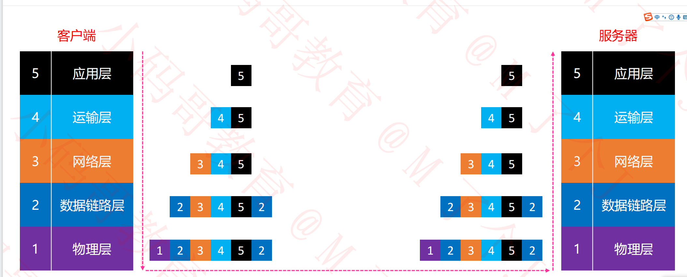
应用层要传输一个数据，会经过模型的其他几层，在每一层都会添加首部，数据链路层还会添加尾部。将其封装后最后通过线路传输。

网络分层如下所示：
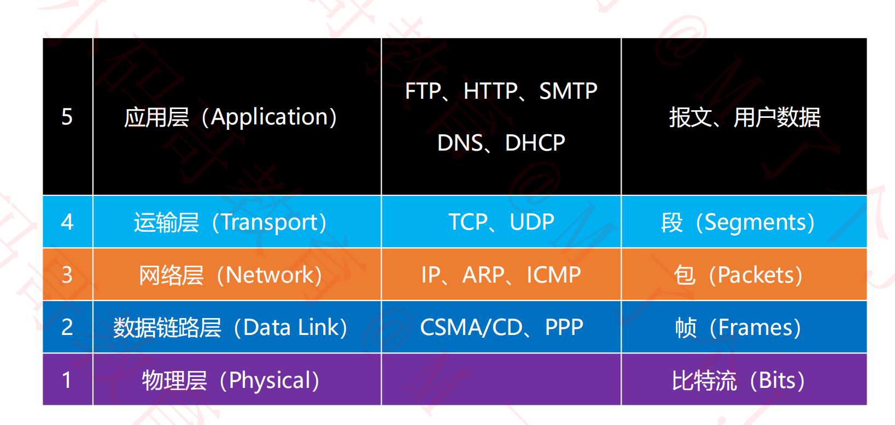

## 不同协议网络模型不同

不是每个协议都会经历五层模型。
比如数据链路层的 PPP 协议和 CSMA/CD 协议，这两个协议是工作在数据链路层的协议，他们是不会经历应用层、传输层和网络层的。
再比如 ARP、ICMP 等网络层协议，是直接工作在网络层的，对这些协议来说就只有 3 层网络模型，直接一上来就在网络层将数据封装好传递给链路层，然后链路层再经历封装后传输给物理层

# 六、物理层（Physical）

物理层定义了接口标准、线缆标准、传输速率、传输方式等。

## 数字信号 & 模拟信号（了解）

模拟信号：

1.  连续的信号，适合长距离传输
2.  抗干扰能力差，受到干扰时波形变形，很难纠正。

数字信号：

1.  离散的信号，不适合长距离传输
2.  抗干扰能力强，受到干扰是波形失真可以修复

## 数据通信模型（了解）

1. 局域网通信模型：
   注意：网线一般不超过 100 米
   PC = 网线（数字信号）=> 集线器/交换机 = 网线（数字信号） => PC

2. 广域网通信模型：

   PC（A） = 网线（数字信号） => 调制解调器（A） = 电话线（模拟信号） => 调试解调器（B） =网线（数字信号） => PC（B）

   上图是电话线传输，如今也有很多光纤传输，和上图模型基本类似，只不过调制解调器不再是转换数字信号和模拟信号，而是转换数字信号和光信号，电话线也替换为光纤即可。

## 信道（了解）

信道：信息传输的通道，一条传输介质（比如网线）上可以有多条信道
比如进行 A 和 B 同时向对方发消息，实际上就是通过了 2 条信道，但是网线是同一根。

- 单工通信：
  信号只能往一个方向传输，任何时候都不能改变信号的传输方向。比如无线电广播，有限电视等。不存在电视需要向电视台发送数据的场景，所以使用单工即可。

- 半双工通信：
  信号可以双向传输，但是必须是交替进行，同时一时间只能往一个方向传输。比如对讲机（老式），有人说话时其他人不能说话。
- 全双工通信：
  信号可以同时双向传输（比如手机，打电话时可以同时说和听）

# 七、数据链路层（Data Link）

链路：从 1 个节点到相邻节点的一段物理线路（有限或无线），中间没有其他交换节点。

路由器、交换机之间的传输就是一段链路，但是集线器不算，集线器本身就相当于网线，没有做处理。但是路由器和路由器的通信和交换机是不同的，路由器和路由器通信会修改数据的目标 MAC 地址，而如果是交换机中转则不会。

数据链路：在一条链路上传输数据时，需要有对应的通信协议来控制数据的传输。
不同类型的数据链路，所用的通信协议可能是不同的。

广播信道：CSMA/CD 协议（比如同轴电缆、集线器等组成的网络）
点对点信道：PPP 协议（比如 2 个路由器之间的信道）

数据链路层的 3 个基本问题（了解即可）：

1. 封装成帧
2. 透明传输
3. 差错检验

### 封装成帧

结构： 帧首部（SOH，含帧开始符） == 帧的数据部分 == 帧尾部（EOH，包含帧结束符）

- 帧（Frame）的数据部分：
  就是网络层传递下来的数据包（IP 数据包，Packet）
- 最大传输单元 MTU（Maxinum Transfer Unit）
  每一种数据链路层协议都规定了所能够传送的帧的数据长度上限。帧的数据部分不能超过 MTU 大小
  如以太网（CSMA/CD 协议）的 MTU 为 1500 个字节 。

### 透明传输

数据部分一旦出现 SOH、EOH，就需要进行转义。否则被误当做开始会结束帧，数据就不对了。
之所以较透明传输就是因为你发送的原始数据和接收到的数据之间可能在协议内转义了，这外部不被感知。

### 差错检验

FCS：根据帧的数据部分和帧首部（去除帧开始符）计算得出
帧尾部包含 FCS。帧发送时会先计算得到 FCS，一起传输给接收方。
接收方接到数据后，也会计算一遍 FCS，如果两者一致，代表数据传输 ok，如果不一致网卡就会丢弃。

不同协议帧首部和帧尾部的封装可能是不一样的。所以如果数据从一种链路传递到了另一种数据链路，那就会先将原帧的首部和头部去除，拿到帧的数据部分，再封装上自己协议的帧首部和帧尾部进行传输。 这就会造成不同数据链路的比特流可能会不同

## CSMA/CD 协议

CSMA/CD（Carrier Sense Multiple Access with Collision Detectio）协议 （如集线器应用）
载波侦听多路访问/冲突检测

载波侦听：侦听信道上是否有信号正在传输，在单工或半双工通信中应用。
多路访问：就是连接着的设备都可以发送信号
冲突检测: 如果信号传输过程中产生了冲突,则会被弹回。冲突检测就是检测出收到的信号是来自其他设备的传输信号。还是自身发出信号的回弹。

◼ 使用了 CSMA/CD 的网络可以称为是以太网（Ethernet），它传输的是以太网帧

- 以太网帧的格式有：Ethernet V2 标准（使用最多）、IEEE 的 802.3 标准
- 为了能够检测正在发送的帧是否产生了冲突，以太网的帧至少要 64 字节
- 用交换机组建的网络，已经支持全双工通信，不需要再使用 CSMA/CD，但它传输的帧依然是以太网帧
- 所以，用交换机组建的网络，依然可以叫做以太网

## Ethernet V2 帧的格式

结构： 目标 MAC 地址（6 字节） | 源 MAC 地址（6） | 类型（2）| 数据 | FCS （4）

这种格式的帧到了物理层的结构：

      插入8字节| 上方的以太网帧

      插入的8字节中，前7字节为前同步码，最后1字节为帧开始定界符。

首部：源 MAC + 目标 MAC + 网络类型（IPv4 or IPv6）
以太网帧：首部+数据+FCS
数据的长度至少： 64 - 6 - 6 - 2 - 4 = 46 字节

该中格式的帧是没有帧开始符和帧结束符，帧开始是用了物理层的帧开始定界符。以太网使用曼彻斯特编码，该编码根据信号跳变判断帧结束。

当数据部分的长度小于 46 字节时

1. 数据链路层会在数据的后面加入一些字节填充
2. 接收端会将添加的字节去掉

长度总结：

以太网帧的数据长度：46~1500 字节
以太网帧的长度：64~1518 字节（目标 MAC +源 MAC + 网络类型 + 数据 + FCS）

### PPP 协议

结构： 帧开始符 | Address | Control | 协议 | 数据部分 | FCS | 帧结束符

数据部分左边为首部、数据部分右边为帧尾部

帧开始符、帧结束符：0x7E
Address 字段：图中的值是 0xFF，形同虚设，点到点信道不需要源 MAC、目标 MAC 地址
Control 字段：图中的值是 0x03，目前没有什么作用
Protocol 字段：PPP 协议内部用到的协议类型

字节填充
即开始符和结束符的转义。如果数据部分有 7E，则转化为 7D5E,5E 即为字节填充，如果就是传输 7D，则转义为 7D5D。换句话说接收方收到 7D，则认为转义，如果跟着 5E，整个数据为 7E。如果跟着 5D，则数据为 7D

## 网卡

网卡工作在物理层和数据链路层。内部有 MAC 地址。

- 物理层：
  物理连接和数字信号同步、数据的编码与解码
- 数据链路层：
  帧的差错校验、帧的封装与拆封、介质访问控制（CSMA/CD）

  流程：
  网卡接收到比特流 => 进行差错校验 => 丢弃校验失败的帧，校验成功的帧拆封（去掉 FCS） =>向上传输

- 网卡接收到一个帧，首先会进行差错校验，如果校验通过则接收，否则丢弃
- Wireshark 抓到的帧没有 FCS ，因为它抓到的是差错校验通过的帧（帧尾的 FCS 会被硬件去掉）
- Wireshark 抓不到差错校验失败的帧

# 八、网络层（Network）

网络层数据包（IP 数据包，Packet）由首部、数据 2 部分组成
数据：很多时候是由传输层传递下来的数据段（Segment）

其结构包含首部和数据部分。首部又分为固定部分（20 个字节）和可变部分。很多时候只有固定部分。如下图所示
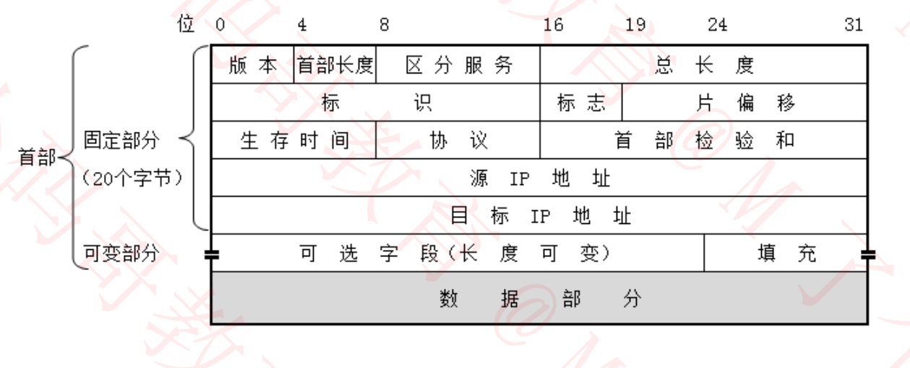

首部包含（可通过 wireShark 抓包对比）着很多信息，下面重点分析。

## 1. 版本（Version）

占 4 位。0b0100：IPv4；0b0110：IPv6

## 2. 首部长度（Header Length）

占 4 位，二进制乘以 4 才是最终长度。0b0101：20（最小值、因为首部固定部分已经 20 字节了）；0b1111：60（最大值）

## 3. 区分服务（Differentiated Services Field）

占 8 位，可以用于提高网络的服务质量（QoS，Quality of Service）。
比如路由器发现某个包的网络层头部区分服务值不是 0，并且和路由器内设置的 Qos 值一致，则可让该数据包优先通过。

## 4. 总长度（Total Length）

占 16 位，首部 + 数据的长度之和，最大值为 65565 字节，2 的 16 次方。

- 之前说过，以太网数据链路层的 MTU 为 1500 字节，所以过大的 IP 数据包，需要分成片（fragments）传输给数据链路层。
- 每一片都有自己的网络层首部（IP 首部）

## 5. 标识（Identification）

占 16 位，数据包的 ID，当数据包过大进行分片时，同一个数据包的所有片的标识都是一样的。
有一个计数器专门管理数据包的 ID，每发出一个数据包，ID 就加 1（总共可以计 65565 个数据包 ID，一旦到 65535，就从头开始）

## 6. 标志（Flags）

占 3 位。

1. 第 1 位（Reserved Bit）：保留
2. 第 2 位（Don't Fragment）：1 代表不允许分片，0 代表允许分片
3. 第 3 位（More Fragments）：1 代表不是最后一片，0 代表是最后一片

## 7. 片偏移（Fragment Offset）

占 13 位。
片偏移乘以 8 = 字节偏移。 所谓字节偏移，就是该片是从数据包的第几个字节开始的。有了字节偏移，即可将片拼装成数据包了。 不直接表示字节偏移是担心数据包较大时，13 位表示不下字节偏移。
所以每一片的长度一定是 8 的整数倍。这样片偏移和字节偏移的对应才是准确的。

## ping 的 几种用法

后续实验需要使用

1. ping /?
   查看 ping 的用法
2. ping ip 地址 -l 数据包大小
   发送指定大小的数据包
3. ping ip 地址 -f
   不允许网络层分片
4. ping ip 地址 -i TTL
   设置 TTL 的值
5. 通过 tracert、pathping 命令，可以跟踪数据包经过了哪些路由器

## wireShark 实验

分析： ping juejin.cn -l 800

1. ICMP 协议查看下的：Total Length: 828。包含首部 20+数据部分 828（数据 800+ICMP 协议头 8）

分析： ping juejin.cn -l 4000
过滤条件 ip.addr = 地址

1. 分片传输，前几片 wireShark 还无法确定传输协议，所以显示的协议是 IPv4，所以无法使用协议 icmp 进行过滤。
2. Total Length: 前两片为 1500。刚好是帧数据部分的最大长度。最后一位为 1068。
   前两片 1500-20（首部长度），最后一片 1068 - 20 - 8（ICMP 协议头部）

total = (1500-20)\* 2 + (1068 - 20 - 8) = 4000 3. 标志（Flags）：前两片第三位（More Fragements）为 1，代表还有更多片，第三片为 0，代表无更多片了。 4. Identification: 同一个包三片的标识是一样的。

## 8. 生存时间（Time To Live TTL）

- 占 8 位
- 每个路由器在转发之前会将 TTL 减 1，一旦发现 TTL 减为 0，路由器会返回错误报告
- 观察 ping 命令后的 TTL，能够推测出对方的操作系统、中间经过了多少个路由器

| 操作系统 |           版本            | 默认 TTL |
| -------- | :-----------------------: | -------: |
| Windows  |  Server 2003、XP、7、10   |      128 |
| Linux    |  2.0X kernel、Red Hat 9   |       64 |
| Linux    | 2.2.14 kernel、2.4 kernel |      255 |
| Mac OS   |                           |       60 |
| Mac OS X |                           |       64 |

为什么要有生存时间：
比如两个路由器的默认路由都是对方（网管配置错误），如果没有 TTL，路由就死循环了。该包就会一直占用带宽。

## 8. 协议（Protocol）

占 8 位
表明所封装的数据是使用了什么协议

ICPM（1）、IGMP（2）、IP（4）、TCP（6）、EGP（8）、IGP（9）、UDP（17）、IPv6（41）、ESP（50）、OSPF（89）

## 9. 首部校验和（Header Checksum）

用于检查首部是否有错误。
发送前当首部其他字段已经拼装完毕，根据一定算法规则算出首部检验和。 接收方接收到后再计算一遍，进行对比。

## 10、源 IP 地址

占 4 字节

## 11、目标 IP 地址

占 4 字节

# 九、传输层（Transport）

传输层有 2 个协议：

1. TCP（Transmission Control Protocol），传输控制协议
2. UDP（User Datagram Protocol）,用户数据报协议。
   两个协议的特点对比如下图

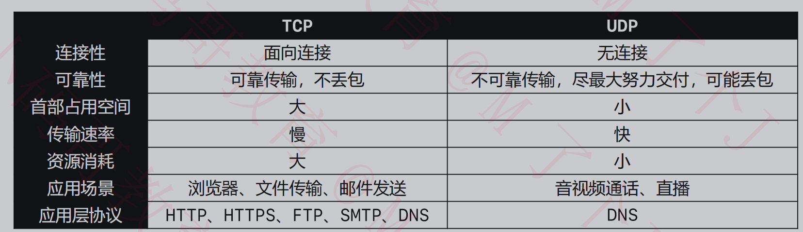

但是不管是 TCP 还是 UDP，都会传递给网络层，封装成网络层的格式进行传输。

## UDP

- UDP 是无连接的，减少了建议和释放连接的开销
- UDP 尽最大能力交付，不保证可靠交付
  因此不需要维护一些复杂的参数，首部只有 8 个字节（TCP 的首部至少 20 个字节）

- UDP 组成：首部+数据
- UDP 首部包含：源端口号（16 位）、目的端口号（16 位）、UDP 长度（16 位）、UDP 校验和（16 位）。如下图所示：

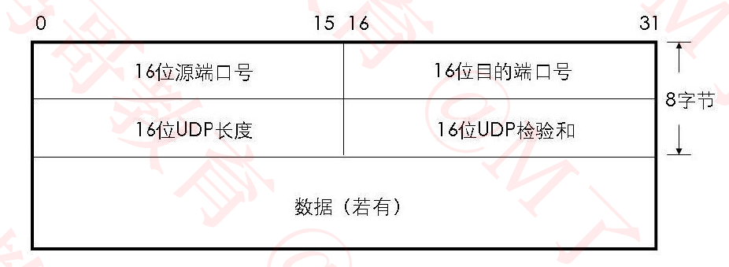

### UDP 首部- UDP 长度（Length）

占 16 位，首部的长度+数据的长度

### UDP 首部- 校验和（Checksum）

校验和的计算内容：伪首部 + 首部 +数据
伪首部：仅在计算校验和时起作用，并不会传递给网络层。包含源 IP 地址、目的 IP 地址、协议类型、UDP 长度等内容。加上伪首部是为了增强校验和，增加安全性。

### UDP 端口（Port）

- UDP 首部中端口是占用 2 字节，所以范围位 0~65535
- 客户端的源端口是临时开启的随机端口。
  它的作用是什么呢，比方说客户端发了两个 UDP 请求，当数据回传时，无法区分返回的数据是哪次请求的。而处理机制就是根据随机端口来的，以随机端口为标志标记本条 UDP 请求。请求结束后端口就会关闭。
- 防火墙可以设置开启\关闭某些端口来提高安全性
  比方说 MySQL 数据库的默认端口是 3306，那防火墙就可以设置 TCP 协议 3306 端口隔绝。只能内部访问 3306 端口，提高安全性。
- 常用命令行
  netstat –an：查看被占用的端口
  netstat –anb：查看被占用的端口、占用端口的应用程序
  telnet 主机 端口：查看是否可以访问主机的某个端口
  安装 telnet：控制面板 – 程序 – 启用或关闭 Windows 功能 – 勾选“Telnet Client” – 确定

  - 不同协议的默认端口

  | 协议  |  默认端口号  |
  | ----- | :----------: |
  | HTTP  |   TCP + 80   |
  | HTTPS |  TCP + 443   |
  | FTP   |   TCP + 21   |
  | MySQL |  TCP + 3306  |
  | DNS   | UDP/TCP + 53 |
  | SMTP  |   TCP + 25   |
  | POP3  |  TCP + 110   |

  ## TCP

  ### TCP 数据格式

  TCP 结构如下图所示：

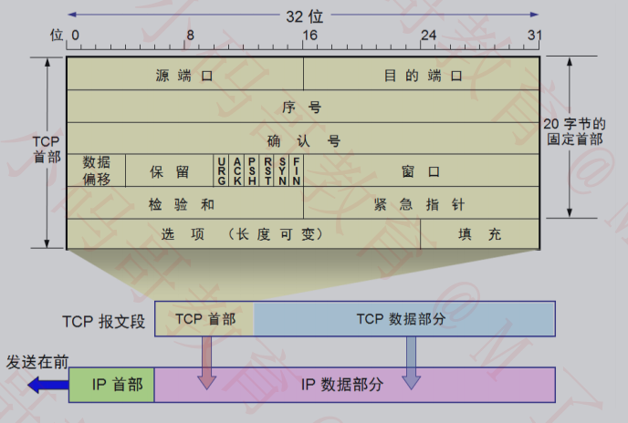

    TCP 的首部至少 20 字节，最大可以到 60 字节，为什么 TCP 的首部比 UDP 大很多，是因为 TCP 以下几个特点：

    1. 可靠传输
       如果丢包了会重传。
    2. 流量控制
       通过窗口大小字段，告知服务器传输速率。 比如 TCP 缓存空间快用完了，或者客户端网络差，处理不过来时，也可通过该字段，暂缓接收服务器数据
    3. 拥塞控制

    4. 连接管理

    5. 建立连接

    6. 释放连接

TCP 首部还有一个注意点，就是观察 UDP 发现：

- UDP 的首部中有个 16 位的字段记录了整个 UDP 报文段的长度（首部 + 数据）
- 但是， TCP 的首部中仅有个 4 位的字段记录了 TCP 报文段的首部长度，并没有字记录 TCP 报文段的数据长度。

原因：

- UDP 首部中占 16 位的长度字段是 冗余，纯粹为了保证首部 32bit 对齐，为什么要保证它是 32bit，4 字节对齐呢，因为长度（字节）很多时候是通过乘以 4 算出来的，如果字节数不是 4 的倍数。很容易出问题。
- TCP\UDP 的数据长度，完全可以由 IP 数据包的首部推测出来
- 传输层的数据长度 = 网络层的总长度 – 网络层的首部长度 – 传输层的首部长度

### TCP 首部 - 数据偏移

- 占 4 位，取值范围是 0x0101~0x1111
- 数据偏移 \* 4 = 首部长度(Header Length)
- 首部长度是 20~60 字节

以上三个特点和网络层的 “首部长度（Header Length）” 字段类似。为什么叫数据偏移呢，因为对于传输数据来说，TCP 首部就是偏移量。去除首部就 是获取的数据了。

### TCP 首部 - 保留

占 6 位，目前全为 0。

这里有一个注意点，有些资料中认为保留位只有 3 位，而标志位有 9 位，但是标志位的 9 位中。前 3 位目前也没有用到，所以也有些资料把标志位 的 前 3 位归为保留位。两种说法都可以。

### TCP 首部 - 检验和（Checksum）

- 跟 UDP 一样， TCP 检验和的计算内容：伪首部 + 首部 + 数据
- 伪首部：占用 12 字节，仅在计算检验和时起作用并不会传递给网络层

### TCP 标志位（Flags）

1. URG（Urgent）:
   当 URG = 1 时，紧急指针（首部另一个字段）字段才有效。表明当前报文段中有紧急数据，应优先尽快传送
2. ACK（Acknowledgment）：确认号
   当 ACK = 1 时，确认号（首部另一个字段）字段才有效
3. PSH（Push）：使用场景很少，暂且跳过

4. RST（Rest）：
   当 RST = 1 时，表明连接中出现严重错误，必须释放连接，然后再重新建立连接
5. SYN（Synchronization）：
   当 SYN = 1、ACK = 0 时，表明这是一个建立连接的请求
   若对方同意建立连接，则恢复 SYN = 1、ACK=1
6. FIN（Finsh）
   当 FIN = 1 时，表明数据已经发送完毕，要求释放连接

### TCP 首部 - 序号（Sequence Number ）

- 占 4 字节
- 首先，在传输过程的每一个字节都会有编号
- 在建立连接后，序号代表：这一次传给对方的 TCP 数据部分的第一个字节编号
  TCP 传输数据过大，要分多次传输时，序号就可以用来帮助拼装（个人理解）

### TCP 首部 - 确认号（Acknowledgment Number ）

- 占 4 字节
- 在建立连接后，确认号代表：期望对方下一次传过来的 TCP 数据部分的第一个字节编号
  也相当于告知对方你此前发过来的字节我已经收到，你下一次应该从数据的哪个字节开始发。比如已收到 1460，那返回的确认号就应该是 1461

### TCP 首部 - 窗口（Window）

- 占 2 字节
- 这个字段有流量控制功能，用以告知对方下一次允许发送的数据大小（字节为单位）

<!-- TCP首部内容结束，以下为TCP各特点详细说明 -->

### TCP 可靠传输

#### 可靠传输 - 停止等待 ARQ 协议

ARQ（Automatic Repeat–reQuest）自动重传请求

它的核心就是超时重传，超时有几种情况：

1. 客户端发的数据未到服务端
2. 客户端发的数据到服务端了，但是服务端发现数据有问题，直接丢包
3. 客户端发的数据到服务端了，服务端返回确认时没有到达客户端，客户端超时重传，服务端收到两个同样的包时，会把之前收到的包丢弃
4. 服务端收到确认返回给客户端时，因网络延迟迟到了，客户端超时重传，服务端同样丢弃重复包，再次发送确认。发送了两次确认，客户端对后一次确认忽略。

上述方式效率相对较低，所以后来发展出了以下方式：

#### 可靠传输 - 连续 ARQ 协议 + 滑动窗口协议

- 建立连接后，接收方 B 会同时发送窗口大小（接收方缓存可用空间）给发送方 A。
- 发送方 A 根据窗口大小将数据分包，比如窗口大小是 4000，而每次只能发 1500 字节，所以需要分 3 次发送。要注意的是，一个窗口内的 3 次 TCP 请求，可以连续发送，这就是连续 ARQ 的含义。而 B 只需要在窗口大小最后一次请求时返回确认报文。里面携带确认标志，以及确认号。
- A 只有在收到 B 的确认报文后，才会发送内存中下一个窗口数据，好比窗口滑动了，所以是窗口滑动协议。 其实 B 接收的数据也是先放在缓存中，当收到 A 下一次窗口数据时，也会将前一个窗口数据发送给应用程序，并从缓存中删除
- 如果 A 发送窗口数据过程中，第二个包丢失了，那么 B 返回的确认号只会从已经收到的第一段数据计算，比如 1480，虽然第三段数据也收到了，但是不能叠加。

- A 接收到 B 的确认号后，发现不是完整的窗口带下，就会从 1480 开始重传，将后面两个包再发送一次（现在有选择确认技术 - SACK，服务端可以选择确认，这样客户端明确知道第二个包丢失了，就只发送第二个包）。

- B 确认过程中会携带下一次窗口大小，窗口大小随着 B 主机的运行情况可能是会变的。

#### 选择性确认（SACK）

- 在 TCP 通信过程中，如果发送序列间某个数据包丢失（比 1、2、3、4、5 中的 3 丢失了）
- TCP 会通过重传最后确认的分组后续的分组（最后确认的是 2，会重传 3、4、5）
- 这样原先已经正确传输的分组也可能重复发送（比如 4、5），降低了 TCP 性能

为改善上述情况，发展出了 SACK（Selective acknowledgment，选择 性确认）技术

- 告诉发送方哪些数据丢失，哪些数据已经提前收到
- 使 TCP 只重新发送丢失的包（比如 3），不用发送后续所有的分组（比如 4、5）

SACK 信息会放在 TCP 首部的选项部分：

1. kind:占 1 字节，值为 5 代表这是 SACK 选项
2. Length ：占 1 字节。表明 SACK 选项一共占用多少字节
3. Left Edge：占 4 字节，左边界 （受到的一个数据包）
4. Right Edge：占 4 字节，右边界

一对边界信息需要占用 8 字节，由于 TCP 首部的选项分最多 40 字节，所以：

- SACK 选项最多携带 4 组边界信息
- SACK 选项的最大占用字节数 = 4 \* 8 + 2 = 34

#### TCP 几个问题

- 重传次数:
  若有个包重传了 N 次还是失败？ 会一直一直重传直到成功嘛？
  答：不会。取决于操作系统的设置，比如有部分系统，重传 5 次还未成功就会发送 reset 报文（RST），断开 TCP 连接。

- 发送方发送报文不足 接收方窗口大小时：
  如果接收方告诉发送方我的窗口大小为 400，而发送方只发送了 200，接收方接到 200 后会先等待一段时间，因为正常情况下是接收满窗口大小再返回确认报文的。等待一段时间没有数据再传过来时，返回确认报文。
- 为什么选择在传输层就讲数据“大卸八块”，分成多段。而不是等到网络层再分片传递给数据链路层。
  答： 因为可以提高重传的性能
  如果在传输层不分段，一旦出现数据丢失整个传输层的数据的都得重传
  如果在传输层分了段，一旦出现数据丢失只需要重传丢失的的那些段即可

  网络层和数据链路层不具备重传功能。如果再这两层分片，一旦丢包，导致接收方传输层拼装出来的数据和发送方传输层发送的数据不一致，接收方不会返回 ACK 给发送方。发送方未收到回复，一定时间后再次发送整个数据。

### 流量控制

如果接收方的缓存区满了，发送方还在疯狂着发送数据:
接收方只能把收到的数据包丢掉，大量的丢包会极大得浪费网络资源，所以要进行流量控制。

- 什么是流量控制？
  控制发送方的发送速率不要太快，使接收方来得及处理
- 原理
  通过确认报文中窗口字段来控制发送方的发送速率
  发送方的发送窗口大小不能超过接收方给出窗口大小
  当发送方收到接收窗口大小为 0 时（接收方缓存区满了，再发包就会大量丢包），发送方就会停止发送数据

  #### 特殊情况

  - 问题： 说一种特殊情况，接收方缓存用完，给发送方 返回了 0 窗口报文段。之后接收方又有了一些缓存空间，但是不巧给发送方的非 0 窗口报文段丢失了。那么如果这样发送方岂不是一直不能发数据给接收方了？

  - 解决方案：
    当发送发接收到 0 窗口通知时，发送方停止发送报文
    并且同时开启一个定时器，隔一段时间就发个测试报文去询问接收方最新的窗口大小
    如果接收的窗口大小还是为 0，则发送方再次刷新启动定时器。

### TCP - 拥塞控制

先看一下什么是拥塞：
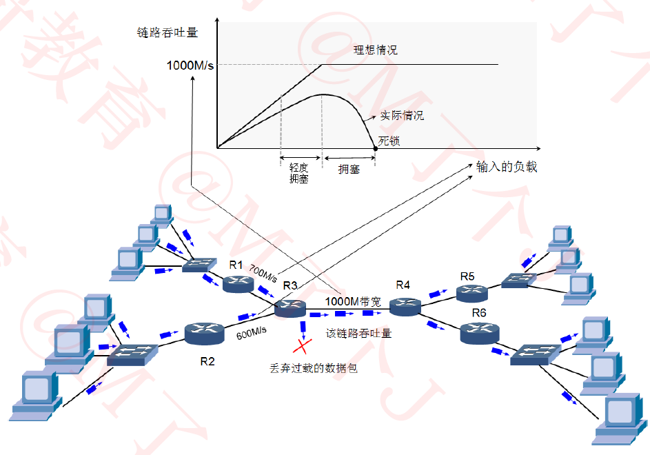;

如上图，1000M 带宽只是理论上每秒能过 1000M 的包，实际到达大概 500 左右时就开始轻度拥塞了，700 时就拥塞了。在往上，800 以上拥塞情况越来越严重，如果持续正价到 1000 多甚至可能出现死锁，网络彻底瘫痪。

这种情况和交通十分类似。1000 辆车通行的道路，500 之前通过率一直递增。因为不堵车速度差不多。一旦再往上，交通拥堵通过率增长变慢，增长到 7、8 百时通过率反而降低了。 再往上交通瘫痪，可能就彻底不动了。

- 拥塞控制：
  防止过多的数据注入到网络中
  避免网络中的路由器或链路过载

- 拥塞控制是一个全局性的过程
  对比流量控制，流量控制是单对单（端对端）的，两台机器间完成的流量控制。但是拥塞控制无法靠几台设备完成。
  涉及到所有的主机、路由器
  以及与降低网络传输性能有关的所有因素。是所有这些因素共同努力地控制结果。

- 拥塞控制-方法：

  1. 慢开始
  2. 拥塞避免
  3. 快速重传
  4. 快速回复

- 几个缩写：

  1. MSS（Maximum Segment Size）：每个段最大的数据部分大小。
     在建立连接时确定。
     在 TCP 首部选项部分，一般为 1400 多，但不一定是 1460（1460 为最大值，1500-20-20）。
     如果发送方的 MSS 和接收方确认返回的 MSS 不一致，则取两者之前的最小值。
     所以很多情况下，建立连接的 TCP 请求首部，是 32 字节，除了固定的 20 字节以外，还有增加一些选项。如 MSS、window Scale、SACK permitted（允许选择性确认）
     实践证明：建立连接时多次头部为 28 字节，MSS 有时候不发送

  2. rwnd（receive window）：接收窗口。最多一次连续发多少数据过来（可以理解为并发数量，接收方只给 1 个返回确认）

  3. swnd（send window）：发送窗口

  4. cwnd（congestion window）：拥塞窗口。根据网络状况调整的窗口大小。
     swnd = min（cwnd，rwnd）

  #### 拥塞控制 - 慢开始

  比如接收方窗口为 3000，但是 MSS 协商为 100（有个疑问，这个 MSS=100 是否是两方根据网络状况设置的），一旦 MSS 设置为 100 后，发送方的拥塞窗口就为 100。所以一开始只会发送 100 字节数据，即使接收方窗口为 3000。

  然后慢慢地增加，100 接收到确认后发送 200，确认后再发送 400，再发送 800 以此类推。

  - 慢开始：cwnd 的初始值（可以设置，TCP 内部也有默认值）比较小，然后随着数据包被接收方确认（收到一个 ACK），cwnd 就成倍增长（指数级）。

  #### 拥塞控制 - 拥塞避免

  - ssthresh（slow start threshold）：慢开始阈值，cwnd 达到阈值后，以线性方式增加
  - 拥塞避免（加法增大）：拥塞窗口缓慢增大，已防止网络过早出现拥塞
  - 乘法减小：只要网络出现拥塞（发送方根据丢包判断），就把 ssthresh 减为拥塞值的一半，与此同时，执行慢开始算法（cwnd 又恢复到初始值即最小值），这个是 TCP 旧版本的做法，新版本采用后面讲到的快速回复。不再从头执行慢开始算法。
  - 当网络出现频繁拥塞时，ssthresh 值就下降的很快

  #### 拥塞控制 - 快重传

  接收方：

  - 每收到一个失序的分组（即中间丢包了）后就立即发出重复确认。（比如收到 1,2,4,5，就会重复确认 2），
  - 使发送方及时知道有分组没有到达，立即重发。而不是等待一定时间后重发。

  发送方：

  - 只要连续收到三个重复确认（总共 4 个相同的确认），就应当立即重传对方尚未收到的报文段而不必继续等待重传计时器到期后再重传

  #### 拥塞控制 - 快恢复

  - 当发送方连续收到三个重复确认说明网络出现拥塞，就执行“乘法减小”算法，把 ssthresh 减半。
  - 与慢开始不同之处是现在不执行慢开始算法，即 cwnd 现在不恢复到初始值，而是把 cwnd 值设置为新的 ssthresh 值（减小后的）
    然后开始执行拥塞避免算法（“加增大大”），使拥塞窗口缓慢地线性增大。

  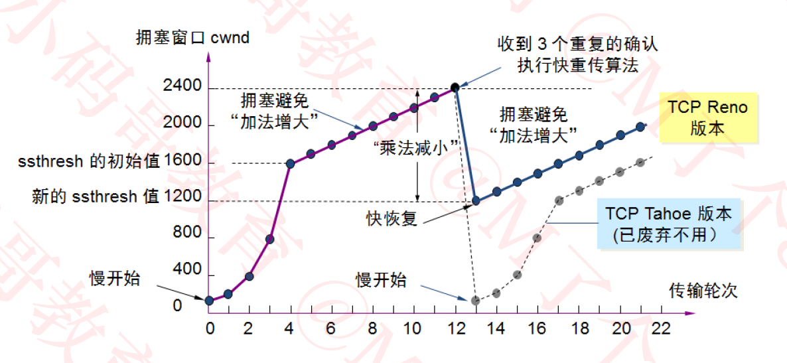;

  #### 拥塞控制总结

  拥塞控制即通过调整发送窗口大小控制发送方的数据发送频率。

  发送窗口最大值 ： swnd = min(cwnd,rwnd)

  当 rwnd < cwnd ：接收方的接收能力限制发送窗口的最大值
  当 cwnd < rwnd： 网络的拥塞限制发送窗口的最大值

  ### TCP - 连接管理

  #### 连接管理 - 建立连接

  发送 HTTP 请求前，需要建立 TCP 连接，就会经过 TCP 三次握手。大致过程如下图所示：
  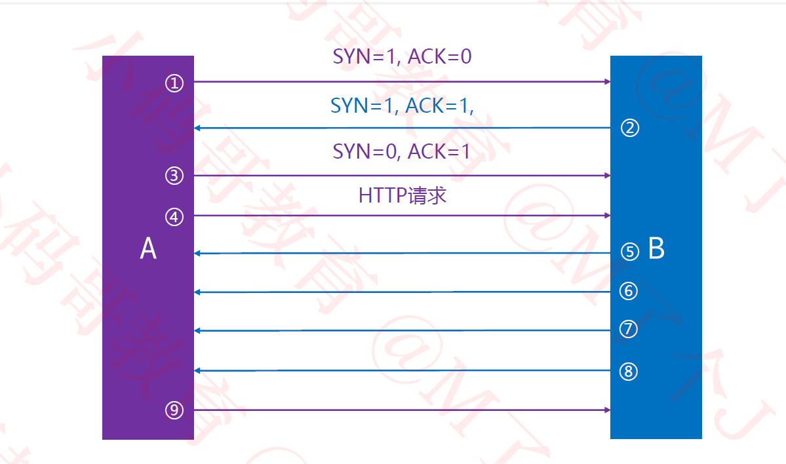;
  上图将 TCP 建立连接的每一步都标上了序号，下面开始详细分析：

  1. SYN = 1; ACK = 0： seq（相对值） = 0； ack（相对值） = 0； seq（原生值） = s1； ack（原生值） = 0；数据 = 0；
     首先客户端发送标志位 SYN = 1；代表建立连接请求。客户端 ACK 标志位为 0，因为此次请求客户端作为发送方不需要确认是否收到。seq 因为数据部分为 0，所以数据部分的第一个字节为 0。ack 作为发送方自然也为 0；
  2. SYN = 1; ACK = 1： seq（相对值） = 0； ack（相对值） = 1； seq（原生值） = s2； ack（原生值） = s1+1；数据 = 0；
     服务端返回确认报文。同时也是服务端向客户端建立连接的请求。所以 SYN=1；ACK = 1。数据部分为 0，seq 为 0，seq 原生值为 s2，服务单和客户端的 seq 原生值是独立的，两者没有关系。ack = 1；因为服务端已经接收到 0 个字节，期望客户端下次发送第 1 个字节。ack 原生值 = s1 + 1；
  3. SYN = 0; ACK = 1： seq（相对值） = 1； ack（相对值） = 1； seq（原生值） = s1+1； ack（原生值） = s2+1；数据 = 0；
     发送方同样返回确认报文给接收方，ACK = 1；但是此次请求不是建立连接请求了，在步骤 1 中已经建立了连接，所以 SYN = 0；
     <!-- TODO：数据部分为0，但seq = 1； -->

     特殊点：数据部分为 0，但 seq = 1；教程解释接收方的 ack= 1；这里配合接收方发送 seq = 1；个人觉得这个理由不成立。接收方期望下次数据从第 1 字节开始发，但是发送方没有发送数据，只是作为确认报文，按规则 seq = 0；
     ack = 1；因为发送方收到了接收方发送的 0 字节，下次期望从 1 字节开始接收。原生值就通过步骤 1、2 中得知的初始值 s1、s2 计算得出。

     以上就是 TCP 三次握手的详细过程，握手完成后就可以建立 HTTT 请求了。三次握手数据部分均为 0。

     原生值就是相对值 + 初始值。如果是发送序号，就加自己那一端的初始值，如果是确认号，因为是已接受对方发送的字节数，所以是加对方的初始值。有了这个规律，以下就讨论相对值。

  4. 客户端返回确认后，立即发送 http 请求，到传输层后包装为 TCP 协议。
     SYN = 0，ACK = 1； seq = 1；ack = 1；数据：k 字节。
     除了建立连接的请求，其他请求 SYN 均为 1，。发送方同时也是接收方，所以 ACK=1，不在赘述。
     服务端还从未向客户端发送过数据，所以下一次期望收到第 1 个字节，ack=1；
     客户端同样未向服务端发送过数据，并且步骤 2 中 ack=1；所以 seq=1；

  - 5、6、7、8 四个步骤类似，都是客户端发送 http 请求后，服务端返回数据，并且分 4 次返回。
    SYN = 0，ACK = 1；seq = 1、b1+1、b2=b1+1、b3+b2+b1+1 ；ack = k + 1； 数据 b1、b2、b3、b4。
    ack 是对步骤 4 的确认，已经收到步骤 4 发送的 k 字节，期望下一次从 k+1 个字节开始发送，所以都为 K+1；seq 第一次服务端未向客户端发送过数据，所以发送数据部分的第一个字节 1，并且发送 b1 字节数据，第二次发送数据部分第一个字节 b1+1。以此类推。

  9. 连续收到 4 个 TCP 数据段，返回确认报文
     SYN = 0，ACK = 1；seq = k + 1; ack = b4+b3+b2+b1+1；
     seq = k + 1：客户端已经在步骤 4 中发送了 k 字节数据，所以下一次从数据部分的 k+1 开始发送（数据部分为 0）。那么这个就是因为响应服务端发送的 ack 值。
     ack = b4+b3+b2+b1+1：步骤 8 中 seq 为 b3+b2+b1+1，其数据部分又为 b4。所以总共收到了 b4+b3+b2+b1 字节数据，下一次就+1 开始发送。

     至此 TCP 通信详细分析了，总结规律如下：

     - 原生值就是相对值 + 初始值
     - seq 一般为发送数据的第一个字节，如果对方发送你 ack 了，那么响应 ack 优先级大于数据部分第一个字节的规律。数据部分为 0，seq 仍然可以不为 0。

     TCP 三次握手客户端和服务端还会有状态值：如下图所示：

     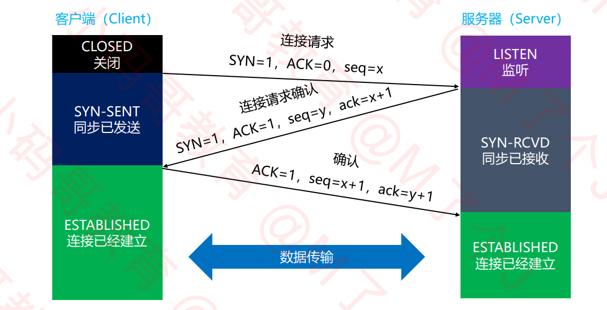;
     它的状态值解读如下：

     - 客户端
       1. CLOSED：client 处于关闭状态
       2. SYN-SENT：表示 client 已发送 SYN 报文，等待 server 的第 2 次握手
       3. ESTABLISHED：表示收到 server 的建立连接请求，连接已经建立。
     - 服务端

       1. LISTEN：server 处于监听状态，等待 client 连接
       2. SYN-RCVD：表示 server 接受到了 SYN 报文，当收到 client 的 ACK 报文后，它会进入到 ESTABLISHED 状态
       3. ESTABLISHED：表示收到 client 的确认报文，连接已经建立。

       ##### 前两次握手的特点：

       1. SYN 都设置为 1，表示是建立连接的请求
       2. 数据部分的长度都为 0
       3. TCP 头部的长度一般是 32 字节。20（固定头部 ） + 12 （可选部分）。可选部分的内容就是双方交换确认的一些信息，包括：MSS、是否支持 SACK、Window scale（窗口缩放系数）等。窗口缩放系数是用来将固定头部的窗口值 乘以 该系数。才是最终的窗口大小。  
          实践证明：建立连接时多次头部为 28 字节，MSS 有时候不发送

       ##### 建立连接 - 常见疑问

       1. 为什么建立连接的时候，要进行 3 次握手？2 次不行么？
          主要目的：防止 server 端一直等待，浪费资源。第一次是客户端要求建立连接，第二次是服务端同意建立连接，问客户端是否同意。如果此时客户端没有返回同意，连接直接建立，会发生如下问题：

       客户端发送建立连接请求，但是此请求因网络延迟没有到达服务端。一定时间后，客户端重发，这次很顺利双方顺利完成建立连接、数据交换、释放连接。此时之前吃到的请求连接到达服务端。
       服务端不知道是迟到的请求，以为客户端再次要求建立连接，返回确认。客户端认为我要的数据已经收到，不予理睬，实际就是不同意建立连接。如果两次握手，此时连接已经建立，服务端就会一直等待客户端请求，浪费资源。

       2. 第 3 次握手失败了，会怎么处理？
          此时 server 的状态为 SYN-RCVD，若等不到 client 的 ACK，server 会重新发送 SYN+ACK 包
          如果 server 多次重发 SYN+ACK 都等不到 client 的 ACK，就会发送 RST 包，强制关闭连接。

  #### 连接管理 - 释放连接

  TCP 四次挥手流程图：

  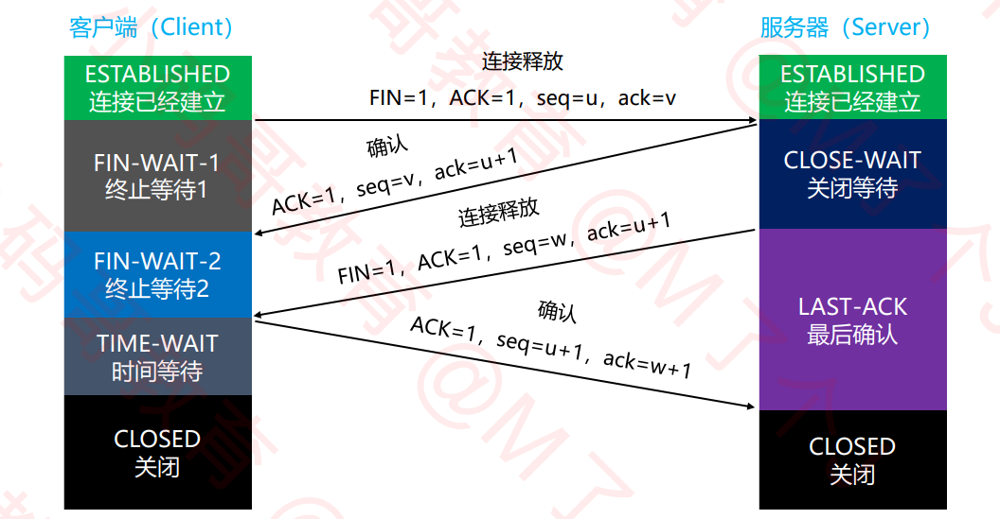;

  TCP/IP 协议栈在设计上，允许任何一方先发起断开请求。只是这里以 client 主动要求断开为例子

  它的状态值解读如下：

  - 客户端
    1. ESTABLISHED：连接已经建立
    2. FIN-WAIT-1：表示想主动关闭连接，客户端发送释放连接[FIN=1、ACK=1]报文，等待服务端返回确认，此时进入到 FIN-WAIT-1 状态。
    3. FIN-WAIT-2： 客户端收到服务端返回的确认释放[ACK=1]报文，就会处于 FIN-WAIT-2 状态，等待服务端发送释放连接报文
    4. TIME-WAIT: 表示收到了服务端的 FIN 报文，并发送出了 ACK 报文，就等 2MSL 后即可进入 CLOSED 状态了。
       如果 FIN-WAIT-1 状态下，收到了对方同时带 FIN 标志和 ACK 标志的报文时。可以直接进入到 TIME-WAIT 状态，而无须经过 FIN-WAIT-2 状态。这种情况就出现了三次挥手。服务端把第二次和第三次挥手合并了。因为收到客户端释放连接报文后，服务端无数据要发送。所以可以合并。
    5. CLOSED：关闭状态
  - 服务端

  1.  ESTABLISHED：连接已经建立
  2.  CLOSE-WAIT：表示在等待关闭。
      当客户端发送 FIN 给自己，自己会回应一个 ACK 报文给客户端，此时则进入到 CLOSE-WAIT 状态
      在此状态下，需要考虑自己是否还有数据要发送给对方，如果没有，发送 FIN 报文给客户端
  3.  LAST-ACK ：服务端在发送 FIN 报文后，最后等待客户端的 ACK 报文。一旦收到 ACK 报文，就立即进入 CLOSED 状态。
  4.  CLOSED：关闭状态

  将客户端和服务端的状态合起来解读，就是整个四次挥手的过程了。

  注意点：

  - CLOSING：一种比较罕见的例外状态。但是是存在于实际的。代表双方都正在关闭连接。
    客户端发送 FIN 报文后，并没有接收到 ACK 报文，反而收到了服务端的 FIN 报文。
    这种情况说明双方都在同时准备关闭连接，几乎同时发送 FIN 报文。那么双方随即进入 CLOSING 状态。
  - 由于有些状态的时间比较短暂，所以很难用 netstat 命令看到，比如 SYN-RCVD、FIN-WAIT-1 等
  - 客户端为什么要有 TIME-WAIT 状态？
    如果客户端收到服务端发送的 FIN 报文并且返回 ACK 报文后马上关闭，那么此时实际无法确认服务端是否收到了客户端的 ACK 报文。服务端超时重传，可能引发：
    1.  客户端没有任何响应，服务端就长时间等待，多次重发 FIN，浪费资源。重发到指定次数才会发送 RST 报文，强制关闭连接。
    2.  客户端已经关闭连接了，发送端口不再被占用。如果刚还又有一个新的应用程序分配了同一个端口。新的应用程序马上会收到 FIN 报文。导致它马上关闭连接。本来要发的数据无法发送了。

  所以客户端需要等待一定时间，确认服务端收到了自己发送的 ACK 报文才关闭连接。这个时间一般是 2MSL。

  - TIME-WAIT 状态到底等待多久？
    等待 2MSL
    2MSL（Maximum Segment Lifetime）：最大分段生存期。MSL 是 TCP 报文在 Internet 上的最长生存时间
    每一个具体的 TCP 实现都必须选择一个确定的 MSL 值，一般建议是 2 分钟。、
    用来防止本次连接中产生的数据包误传到下一次连接中（因为本次连接中的数据包都会在 2MSL 时间内消失了）

  - 为什么释放连接的时候，要进行 4 次挥手？
    首先 TCP 是全双工模式，客户端和服务端可能同时在发送数据。

    1. 第 1 次挥手：当客户端发出 FIN 报文时：
       表示客户端告诉服务端，客户端已经没有数据要发送了，但是，此时客户端还是可以接受来自服务端的数据
    2. 第 2 次挥手：当服务端返回 ACK 报文段时：
       表示服务单已经知道客户端没有数据发送了，但是服务端还是可以发送数据到客户端的
    3. 第 3 次挥手：当服务端也发送了 FIN 报文段时：
       表示服务单告诉客户端，服务端已经没有数据要发送了
    4. 第 4 次挥手：当客户端返回 ACK 报文段时：
       表示客户端已经知道服务端没有数据发送了。随后正式断开整个 TCP 连接

    分析：第 1、2 两次挥手肯定是必要的。假设没有 3、4 两次挥手。服务端返回确认报文后，双方断开连接，会发生什么？
    服务端自己的数据部分可能还没有发送完成。双方就关闭连接，导致数据丢失。如果说服务端强制等待数据发送完成再返回确认。可能时间就太长了，客户端超时重发。

    如果 1、2、3 后双方断开连接。那么产生的问题就是服务端无法确认自己的 FIN 请求客户端是否收到。如果没有收到，那么服务端一方自己断开连接。客户端并不知道。

  - 3 次挥手？ 有时候在使用抓包工具的时候，有可能只会看到 3 次挥手。这其实是将第 2、3 次挥手合并了。
    当 server 接收到 client 的 FIN 时，如果 server 后面也没有数据要发送给 client 了。
    这时，server 就可以将第 2、3 次挥手合并[ACK=1、FIN=1]，同时告诉 client 两件事：
    已经知道 client 没有数据要发
    server 已经没有数据要发了

  #### 实际开发：

  TCP 连接建立后，如果不采取措施，连接的保持是很长的，服务器会一直出在等待状态。

  1.  保活：
      所以实际开发时，服务端一般会设置一个超时时间，比如如果客户端 30s 内不发送数据，服务端主动断开连接。
      客户端为了不让服务端断开连接，可能每隔 30 秒主动发一个请求。
      这个过程叫做保活。这个是代码自己实现的应用层保活。
      TCP 自己有 keep-alive 属性，类似保活功能，但是一般不用。自己实现更加灵活。

  #### 课后问题：

  1. 长连接和短连接怎么区分？
     一般我们认为进行了一次数据交互，交互完成后断开连接的情形就是短连接，类似 http。
     建立连接后，中途可以一直进行数据交互。主动发送断开连接时才断开的，认为是长连接，类似 websocket。

  2. 假设建立连接之后，没有断开连接影响是啥？
     建立连接之后，客户端和服务端都会建立 socket 对象，存储在内存中。如果不断开，就会一直存在内存中，浪费内存。但是对网卡没有影响。网卡就是接收数据包，检查 MAC 地址是否是自身的。如果是就向上传递。建立连接不断开，也不互相发送数据，对网卡是没影响的。
  3. 假设数据太多，网卡已经接收不过来数据，怎么办？
     网卡会直接丢弃。一般是到达数据链路层。网卡会有缓冲区，缓冲区满了再过来数据就会丢弃。到不了网络层及以上。

  ### TCP 总结

  1. 可靠传输：将丢了的包进行重传
  2. 流量控制：点对点控制，通过窗口字段告知对方降低发送速率。
  3. 拥塞控制：网络中的所有设备根据一定规则保证整个网络的顺畅。规则：慢开始、拥塞避免（加法增大）、快重传、快恢复。

# 十、应用层（application）

## 常见协议：

- 超文本传输： HTTP、HTTPS
- 文件传输： FTP
- 电子邮件：SMTP、POP3、IMAP
- 动态主机配置：DHCP
- 域名系统：DNS

## DNS

DNS 的全称是：Domain Name System，域名系统
利用 DNS 协议（应用层协议），可以将域名（比如 baidu.com）解析成对应的 IP 地址（比如 220.181.38.148）
DNS 可以基于 UDP 协议，也可以基于 TCP 协议，DNS 服务器默认端口 53 。

当我们在浏览器中敲下一个域名时：

1. 首先会在计算机缓存里查找该域名，如果有就直接取出域名对应的 ip 地址进行通信，经过路由器到达目的 ip。
2. 如果没找到，就会请求 DNS 服务器（客户端发送一个 DNS 数据包，通过 DNS 协议给 DNS 服务器）。DNS 服务器上存放着域名对应的 IP 地址。请求过来后使用同样方式到达目标 IP。此时再请求一次，就会直接读取缓存了。

### 常用命令

ipconfig /displaydns：查看 DNS 缓存记录
ipconfig /flushdns：清空 DNS 缓存记录
ping 域名
nslookup 域名

### DNS - 服务器

- 客户端首先会访问最近的一台 DNS 服务器（也就是客户端自己配置的 DNS 服务器，一般也可以叫本地名称服务器）
  可通过： 网络和 Internet => 以太网 => 更改适配器选项 => 以太网属性 => Internet 协议版本 4（TCP/IPv4）=> 可选自动获得 DNS 服务器地址（默认）或者手动配置。
  就是离该计算机最近的一台 DNS 服务器。该服务器是有缓存机制的。

- 所有的 DNS 服务器都记录了 DNS 根域名服务器的 IP 地址
  根域名是域名结尾的一个. 平时认为的 “baidu.com”，它的完整域名其实是 “baidu.com.”，最后这个点就是根域名
- 上级 DNS 服务器记录了下一级 DNS 服务器的 IP 地址
  比如本地名称服务器缓存中没有，就将包发给根域名服务器。根域名服务器下记录了顶级域名的 IP 地址。比如.com .gov 等然后.com 下又记录了二级域名的 IP 地址，比如 baidu.com geogle.com 等就这样一级一级最终找到目标 DNS。 这样分层主要是因为万维网中的域名太多了，不可能又一台服务器可以放下所有域名。分层实际上就是只保存树结构数据的一层或几层的数据。
- 全球一共 13 台 IPv4 的 DNS 根域名服务器、25 台 IPv6 的 DNS 根域名服务器

它的具体过程如下图所示：
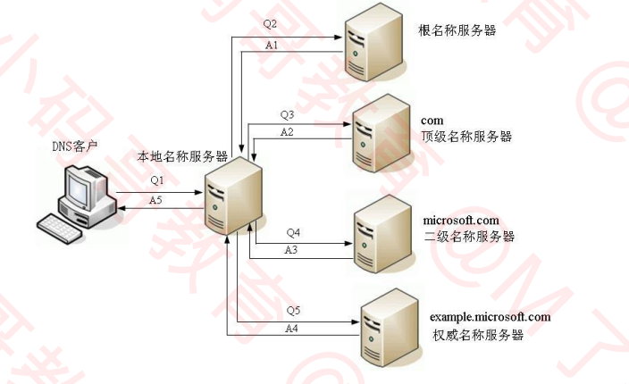

查找过程都是通过本地名称服务器完成的。本地名称服务器发现缓存中没有，就会和根域名服务器通信，根域名服务器根据你请求的域名的顶级域名，返回该顶级域名服务器 IP 地址。然后本地名称服务器再去请求顶级域名服务器，顶级域名服务器再根据域名返回二级域名服务器地址，以此类推，直到找到最终的域名位为止。

### 域名（Domain Name）

由于 IP 地址不方便记忆，且无法表达组织的名称和性质，所以设计出了域名（比如 baidu.com）。
但实际上，为了能够访问到具体的主机，最终还是得知道目标主机的 IP 地址。（路由器、只认目标 IP）

域名申请注册：https://wanwang.aliyun.com/

- 那为啥不直接全程用域名，抛弃 IP 地址？
  IP 地址固定 4 个字节，域名大部分至少 10 几个字节了，增加路由器的负担，浪费流量。并且域名大小不统一，无疑要分配更多的字节给它。

- 域名分级：

1. 顶级域名（Top-level Domain，简称 TLD）
2. 二级域名
3. 三级域名
   ......

#### 域名-顶级域名

- 通用顶级域名（General Top-level Domain，简称 gTLD）
  .com（公司）
  .net（网络机构）
  .org（组织机构）
  .edu（教育）
  .gov（政府部门）
  .int（国际组织）等

- 国家及地区顶级域名（Country Code Top-level Domain，简称 ccTLD）
  .cn（中国）
  .jp（日本）
  .uk（英国）等
- 新通用顶级域名（New Generic Top-level Domain，简称：New gTLD）
  .vip、.xyz、.top、.club、.shop 等

#### 域名- 二级域名

二级域名是指顶级域名之下的域名

- 在通用顶级域名下，它一般指域名注册人的名称，例如 google、baidu、microsoft 等
- 在国家及地区顶级域名下，它一般指注册类别的，例如 com、edu、gov、net 等

## DHCP

就是因为 IP 地址分类，获取动态 IP。所以需要 DHCP

DHCP（Dynamic Host Configuration Protocol），译为：动态主机配置协议

- DHCP 协议基于 UDP 协议，客户端是 68 端口，服务器是 67 端口
- DHCP 服务器会从 IP 地址池（IP 范围）中，挑选一个 IP 地址 "出租" 给客户端一段时间，时间到期就回收它们
- 平时家里上网的路由器就可以充当 DHCP 服务器

### IP 地址的分配

IP 地址按照分配方式，可以分为：静态 IP 地址、动态 IP 地址

- 静态 IP 地址：

1. 手动设置
2. 适用场景：不怎么挪动的台式机（比如学校机房中的台式机）、服务器等

- 动态 IP 地址

1. 从 DHCP 服务器自动获取 IP 地址
2. 适用场景：移动设备、无线设备等

### DHCP 分配 IP 地址

1. DISCOVER：发现服务器
   发广播包（源 IP 是 0.0.0.0，目标 IP 是 255.255.255.255，目标 MAC 是 FF:FF:FF:FF:FF:FF）。目的是寻找连接着的 DHCP 服务器
2. OFFER：提供租约
   服务器返回可以租用的 IP 地址，以及租用期限、子网掩码、网关、DNS 等信息。
   注意：这里可能会有多个服务器提供租约
3. REQUEST：选择 IP 地址
   客户端选择一个 OFFER，发送广播包进行回应
4. ACKNOWLEDGE：确认
   被选中的服务器发送 ACK 数据包给客户端
   至此，IP 地址分配完毕

### DHCP - 一些细节

1. DHCP 服务器可以跨网段分配 IP 地址么？（DHCP 服务器、客户端不在同一个网段）
   可以借助 DHCP 中继代理（DHCP Relay Agent）实现跨网段分配 IP 地址
2. 自动续约
   客户端会在租期不足的时候，自动向 DHCP 服务器发送 REQUEST 信息申请续约
3. 常用命令
   ipconfig /all：可以看到 DHCP 相关的详细信息，比如租约过期时间、DHCP 服务器地址等
   ipconfig /release：释放租约
   ipconfig /renew：重新申请 IP 地址、申请续约（延长租期）

## HTTP

- HTTP（Hyper Text Transfer Protocol），译为超文本传输协议
  是互联网中应用最广泛的应用层协议之一
  设计 HTTP 最初的目的是：提供一种发布和接收 HTML 页面的方法，由 URI 来标识具体的资源
  后面用 HTTP 来传递的数据格式不仅仅是 HTML，应用非常广泛

  这里比较有意思的是解释了下什么叫超文本，HTML 内部是写的文本，但是它展示的内容却超出了文本的范畴。比如图片，比如链接等。所以叫超文本。

### HTTP 版本：

1. 1991 年，HTTP/0.9
   只支持 GET 请求方法获取文本数据（比如 HTML 文档），且不支持请求头、响应头等，无法向服务器传递太多信息
2. 1996 年，HTTP/1.0
   支持 POST、HEAD 等请求方法，支持请求头、响应头等，支持更多种数据类型（不再局限于文本数据）
   浏览器的每次请求都需要与服务器建立一个 TCP 连接，请求处理完成后立即断开 TCP 连接
3. 1997 年，HTTP/1.1（最经典、使用最广泛的版本）
   支持 PUT、DELETE 等请求方法
   采用持久连接（Connection: keep-alive），多个请求可以共用同一个 TCP 连接

4. 2015 年，HTTP/2.0
   已经稳定，这部分内容需要补充。面试可能问到。
5. 2018 年，HTTP/3.0
   草拟阶段，还不稳定

### HTTP 标准

由万维网协会（W3C）、互联网工程任务组（IETF）协调制定，最终发布了一系列的 RFC
RFC（Request For Comments），可以译为：请求意见稿
一般是由研发人员在实践过程中发现一些需求或问题或优化点，然后写一篇意见稿，由 W3C 和 IETF 审核，如果通过即成为 HTTP 标准。

### HTTP 报文格式

HTTP 的请求报文有严格的格式限制。如下图所示：HTTP 报文格式
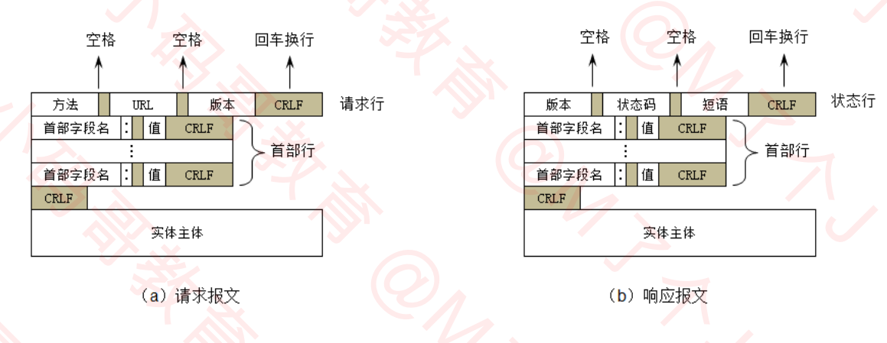

- 请求报文：

  1.  请求行：方法 + 空格 + URI + 空格 + 版本 + 回车换行(CRLF)
  2.  请求头（首部行）：key + 冒号 + 空格 + value + 回车换行(CRLF)
      由多个请求头按照以上格式拼接。
      请求头部分结束后，再来一个回车换行。
  3.  请求体（实体主体）

  网络传输时，以上三部分就是合在一起的二进制数据，只是一些抓包工具把他们做了分类而已。

- 响应报文：

  1. 状态行：版本 + 空格 + 状态码 + 空格 + 短语（很多时候省略） + 回车换行（CRLF）
  2. 响应头（首部行）：同请求头
  3. 实体主体

  ### ABNF（Augmented BNF）

  ABNF 是 BNF（Backus-Naur Form，译为：巴科斯-瑙尔范式）的修改、增强版
  在 RFC 5234 中表明：ABNF 用作 internet 中通信协议的定义语言
  ABNF 是最严谨的 HTTP 报文格式描述形式，脱离 ABNF 谈论 HTTP 报文格式，往往都是片面、不严谨的

  [RFC 2616 4.HTTP Message（旧）](https://datatracker.ietf.org/doc/html/rfc2616#section-4)
  [RFC 7230 3.Message Format（新）](https://datatracker.ietf.org/doc/html/rfc7230#section-3)

  #### ABNF - HTTP 报文整体

  ABNF（官方）定义的 HTTP 报文整体格式：
  HTTP-message = start-line \*( header-field CRLF )CRLF[message-body]

  - start-line = request-line / status-line \*代表一个或多个
  - []可选（可有可无）

  这里可能有个疑问，start-line 后面没有 CRLF，但实际抓包发现 start-line 后是会回车换行的。这是因为 CRLF 被定义在了 start-line 内部。

  #### ABNF - start-line

  start-line 包含 request-line、status-line

  - request-line = method SP request-target SP HTTP-version CRLF
    HTTP-version = HTTP-name "/" DIGIT "." DIGIT DIGIT 代表数字
    HTTP-name = %x48.54.54.50 ; HTTP --RFC 原文
    HTTP-name = %x48（ASCII 码值 H） %x54 %x54 %x50 ; HTTP（注释，解释前面表示的是 HTTP） --个人解释
    例："GET /hello/ HTTP/1.1"
  - status-line = HTTP-version SP Status-code SP reason-phrase CRLF
    status-code = 3DIGIT
    reason-phrase = *( HTAB / SP / VCHAR / obs-text )
    所以 reason-phrase 可以沒有，*代表任意个数
    例："HTTP/1.1 200"、"HTTP/1.1 200 OK"

  #### ABNF - header-field

  header-field = field-name ":" OWS field-value OWS
  fidld-name = token
  field-value = \*(field-content/obs-fold)

  OWS = \*(SP/HTAB)
  OWS 既然代表任意个空格或制表符，所以":"后面可以没有空格，结尾也可以没有或者写多个空格。而普遍做法是":"后面留一个空格，结尾就不留空格了，但从标准来说是更灵活的

  #### ABNF - message-body

  message-body = \*OCTET
  代表任意个字节

  ### URL 的编码

  URL 中一旦出现了一些特殊字符（比如中文、空格），需要进行编码
  在浏览器地址栏输入 URL 时，是采用 UTF-8 进行编码
  比如：
  编码前：https://www.baidu.com/s?wd=百度
  编码后：https://www.baidu.com/s?wd=%E5%8D%8E%E4%B8%BA

  ### 使用 xhell+telnet 模拟 HTTP 客户端

  - 可以直接面向 HTTP 报文与服务器交互
  - 可以更清晰、直观地看到请求报文、响应报文的内容
  - 可以检验请求报文格式的正确与否

  ### HTTP - 请求方法

  RFC 7231, section 4: Request methods：描述了 8 种请求方法
  RFC 5789, section 2: Patch method：描述了 PATCH 方法

  1. GET：常用于读取的操作，请求参数直接拼接在 URL 的后面（浏览器对 URL 是有长度限制的）
  2. POST：常用于添加、修改、删除的操作，请求参数可以放到请求体中（没有大小限制）
  3. HEAD：请求得到与 GET 请求相同的响应，但没有响应体。
     使用场景举例：在下载一个大文件前，先获取其大小，再觉得是否要下载。以此可以节约带宽。而不是使用 GET，使用 GET 会把大文件一同传回来。
  4. OPTIONS：用于获取目的资源所支持的通信选项，比如服务器支持的请求方法。
     可以通过：OPTIONS \* HTTP/1.1
     来获取服务器支持的请求方法，但是用 koa 起的服务试了一下好像不支持。返回 404。
     在跨域请求时，一般会先发送 OPTIONS 请求，确认下服务器所支持的跨域范围、跨域方法和跨域头。
     'Access-Control-Allow-Origin', '\*'
     'Access-Control-Allow-Headers', 'Content-Type, Content-Length, Authorization, Accept, X-Requested-With , yourHeaderFeild'
     'Access-Control-Allow-Methods', 'PUT, POST, GET, DELETE, OPTIONS'
  5. PUT：用于对已存在的资源进行整体覆盖
  6. PATCH：用于对资源进行部分修改（资源不存在，会创建新的资源）
  7. DELETE：用于删除指定的资源

  5、6、7 三种请求方式存在安全问题。所以不推荐使用。--个人疑问：公司实际项目中，硬件的配套 WEB 中实际上是在使用的。具体有什么安全问题？

  8. TRACE：请求服务器回显其收到的请求信息，主要用于 HTTP 请求的测试或诊断
     即服务器收到了什么就返回什么。
  9. CONNECT：可以开启一个客户端与所请求资源之间的双向沟通的通道，它可以用来创建隧道（tunnel）
     可以用来访问采用了 SSL (HTTPS) 协议的站点

  ### HTTP - 头部字段（Header Field）

  头部字段可分为四种类型：

  - 请求头字段（Request Header Field）
    有关要获取的资源或客户端本身信息的消息头，只出现在请求报文中。

  - 响应头字段（Response Header Fields）
    有关响应的补充信息，比如服务器本身（名称和版本等）的消息头，只出现在响应报文中

  - 实体头字段（Entity Header Fields）
    有关实体主体的更多信息，比如主体长度（Content-Length）或其 MIME 类型

  - 通用头字段（General Header Fields）
    同时适用于请求和响应消息，但与消息主体无关的消息头

    说明：

  - 头部字段内的 q 值越大，表示优先级越高，希望服务器优先考虑。如果不指定 q 值，默认是 1.0（1.0 为最大值）

  #### 请求头字段

  1. User-Agent：浏览器的身份标识字符串
     例如："User-Agent: Mozilla/5.0 (Windows NT 10.0; Win64; x64) AppleWebKit/537.36 (KHTML, like Gecko) Chrome/97.0.4692.99 Safari/537.36"  
     作用/场景：例如有的软件下载网页，会根据不同的操作系统，修改默认下载的版本。比如 windows 用户访问，默认下载的版本就是 windows 版本，如果是 Mac 用户访问。默认下载的就是 Mac。 ——当然这个在我看来前段实现貌似更加简单，但 User-Agent 一定是有用的。

  2. Host：服务器的域名、端口号
     例如："Host: 127.0.0.1:3000"

  3. Date：发送该消息的日期和时间
     例如："Date: Wed, 02 Feb 2022 06:52:03 GMT"
  4. Referer：表示浏览器所访问的前一个页面，正是前一个页面的某个链接将浏览器带到了当前这个页面。如果是 HTML 内的其他静态资源如图片，Referer 就是当前网页。即资源的来源。
     例如："referer: https://www.baidu.com/link?url=Tch9JP41BpG_8Prjp0z3ettM-ZvLnjSgoKK9CKmaJhi&wd=&eqid=d54757510005d61a0000000461fa2bde"

     应用：防盗链，除了首页外的其他静态资源，当 Referer 为当前网站时才返回。不然网络上的其他网站直接获取本网站的静态资源。

  5. Content-Type：请求体的类型
     例如："Content-Type: text/html; charset=utf-8"
     POST、PUT 等请求中才会有，必须带有请求体
  6. Content-Length：请求体的长度（单位为字节）
     例如："Content-Length: 289"
     POST、PUT 等请求中才会有，必须带有请求体
  7. Accept：能够接受的响应内容类型（Content-Types）
     例如："Accept: text/html,application/xhtml+xml,application/xml;q=0.9,image/avif,image/webp,image/apng,_/_;q=0.8,application/signed-exchange;v=b3;q=0.9"

  8. Accept-Charset：能够接受的字符集
     例如："Accept-Charset: GB2312,utf-8;q=0.7,\*,;q=0.7"
  9. Accept-Encoding：能够接收的编码方式列表
     例如："accept-encoding: gzip, deflate, br"
  10. Accept-Language：能够接收的响应的内容的自然语言列表
      例如："Accept-Language: zh-CN,zh;q=0.9"

  11. Range：仅请求某个实体的一部分。字节偏移以 0 开始
      例如："Range: bytes=500-999"

      应用：断点续传，记录文件当前下载到的字节数 ——课后自己尝试下

  12. Origin：发起一个针对跨域资源共享的请求
      例如："Origin: https://www.baidu.com"
  13. Cookie：
  14. Connection：该浏览器想要优先使用的连接类型
      例如："Connection: keep-alive"
  15. cache-control：用来指定在这次的请求/响应链中的所有缓存机制都必须遵守的指令
      例如："Cache-Control: max-age=0"

  当我们在浏览器中使用 xhr 发送 ajax 请求时，http 请求头的信息，并不是所有的都可以自主设置。有一些浏览器是禁止你修改的，比如 Refer、Date 等等。

  #### 响应头字段

  1.  Date：同请求头
  2.  Last-Modified：所请求的对象的最后修改时间
      例如："Last-Modified：Tue,15 Nov 2004 12:45:26 GMT"
  3.  Server：服务器名称
      例如："Apache/2.4.1"
  4.  Expires：指定一个超时时间，超过该时间则认为此响应已经过期
      例如："Expires：Tue,01 Dec 2004 16:00:00 GMT"
  5.  Content-Type
  6.  Content-Length

  5、6 同请求头，请求时一般 POST 才会带上。而响应头几乎都会带上。因为请求时服务端几乎总是返回响应体内容。

  7. Content-Disposition：可以使客户端下载文件并建议文件名的头部
     例如：'Content-Disposition: attachment; filename="filename.xls"'
  8. Accept-Ranges：服务器支持哪些种类的部分内容范围
     例如："Accept-Ranges: bytes"
  9. Content-Range：这部分消息是属于完整消息的哪部分
     例如："Content-Range: bytes 21010-47021/47022"

  10. Access-Control-Allow-Origin：指定哪些网站可参与到跨资源共享过程中
      例如："Access-Control-Allow-Origin: \*"

  11. Location：用来重定向，或者创建了某个新资源时使用

  12. set-Cookie：返回一个 Cookie 让客户端去保存

  13. Connection：针对该连接所预期的选项
      例如："Connection: close"
  14. CaChe-control：向从服务器直到客户端在内的所有缓存机制告知，他们是否可以缓存这个对象。单位为秒
      例如："CaChe-control: max-age=3600"

  ### HTTP - 状态码

  在 RFC 2616 10.Status Code Definitions 规范中定义

  状态码大致分为 5 类：

  1. 信息响应：100~199
  2. 成功响应：200~299
  3. 重定向：300~399
  4. 客户端错误：400~499
  5. 服务端错误：500~599

  常见状态码：

  - 100 Contiue
    请求的初始部分已经被服务器收到。并且没有被服务器拒绝。客户端应该继续发送剩余的请求。如果请求已经完成，就忽略这个响应。
    应用场景：在一些请求比较可能被拒绝或者出错的情况下，先不发送请求体，只发送请求行和请求头试探一下服务器是否原因接收并且不出错。 如果没问题再继续发送正常的请求。类似 HEAD 请求。
  - 200 OK：请求成功

  - 302 Found：请求的资源被暂时的移动到了由 Location 头部指定的 URL 上

  - 304 Not Modified：说明无需再次传输请求的内容，也就是说可以使用缓存的内容
    如果使用抓包工具，可以发现 304 时，并没有返回数据。所以是客户端做了缓存。直接使用上次缓存的内容。

  - 400 Bad Request：由于语法无效，服务器无法理解该请求
    发送的 HTTP 格式错误。可能是由服务器本身，比如 Nginx 服务器本身返回的 400。也有可能是 HTTP 格式正确，但是传参不对，由服务器开发人员人为返回 400。
  - 401 Unauthorized：由于缺乏目标资源要求的身份验证凭证

  - 403 Forbidden：服务器端有能力处理该请求，但是拒绝授权访问
    无权限

  - 404 Not Found：服务器端无法找到所请求的资源

  - 405 Method Not Allowed：服务器禁止了使用当前 HTTP 方法的请求
    比如服务器明确使用 GET 请求的资源，你使用其他方式请求了。
  - 406 Not Acceptable：服务器端无法提供与 Accept-Charset 以及 Accept-Language 指定的值相匹配的响应

  - 408 Request Timeout：服务器想要将没有在使用的连接关闭
    一些服务器会在空闲连接上发送此信息，即便是在客户端没有发送任何请求的情况下 -- 疑问，HTTP 是单向的，怎么在客户端没有发送请求的情况下返回？
  - 500 Internal Server Error：所请求的服务器遇到意外的情况并阻止其执行请求
    俗称服务器崩溃了，或者服务器报错停止了。在 Node 中很明显，因为 Node 是单线程的，一旦代码报错，服务器整个崩溃。
  - 501 Not Implemented：请求的方法不被服务器支持，因此无法被处理
    服务器必须支持的方法（即不会返回这个状态码的方法）只有 GET 和 HEAD。它和 405 的区别是，405 一般是服务器支持该方法，只是作为该 URL，客户端使用了错误的请求方法。
  - 502 Bad Gateway：作为网关或代理角色的服务器，从上游服务器（如 tomcat）中接收到的响应是无效的

  - 503 Service Unavailable：服务器尚未处于可以接受请求的状态
    通常造成这种情况的原因是由于服务器停机维护或者已超载

    注意：这些错误码只是参考。服务端研发人员是可以在接收到请求后自由返回状态码的。只是要尽可能接近参考标准。

### HTTP - 缓存（Cache）

浏览器缓存分为内存缓存（Memory Cache） 和 硬盘缓存 （Disk Cache）
通常情况缓存的是：GET 请求 + 静态资源（比如 HTML、CSS、JS、图片等）。Ctrl + F5：可以强制刷新缓存

HTTP 的缓存策略是相对复杂的，总体的流程图如下所示，可根据流程图理解：
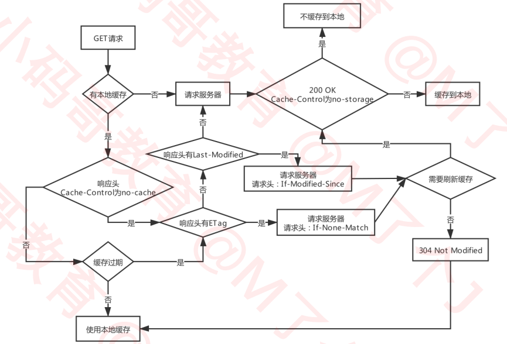

#### 缓存 - 响应头

- Pragma：作用类似于 Cache-Control，HTTP/1.0 的产物
  并且作用存在争议，最好不要使用
- Expires：缓存的过期时间（GMT 格式时间），HTTP/1.0 的产物
  响应头字段。
  它的问题是该绝对时间使用的是服务端的时间，那么带来的问题如果客户端和服务端时钟不同步。或者跨时区，就会存在比较大误差。所以 HTTP/1.1 中用 max-age 的相对时间代替

  上述两点已不常用，了解即可，但是 HTTP/1.1 因为其向前兼容所以仍然可以使用，

- Cache-Control：设置缓存策略

1. no-storage：不缓存数据到本地
2. public：允许用户、代理服务器缓存数据到本地。
   仅体现在响应头，通知浏览器可以无条件的缓存该响应。
3. private：只允许用户缓存数据到本地。  
   仅体现在响应头，通知浏览器只针对单个用户缓存响应. 且可以具体指定某个字段.如 private –“username”
4. max-age：缓存的有效时间（多长时间不过期），单位秒 --（相对时间，相比于 Expires 的绝对时间更好）
   例如：max-age=3600

   如果时间超过 max-age 设置的时间，那么浏览器认为缓存过期。这个时候会重新请求服务器
   这个时候服务器会根据你的请求（请求中会带有一些资源描述）和服务器上的资源做比对，如果文件改变了，那么就重新返回资源。否则就会返回 304 状态码。告诉浏览器资源没有被改变过。

5. no-cache：每次需要发请求给服务器询问缓存是否有变化，再来决定如何使用缓存
   请求头中：告诉浏览器回去服务器取数据，并验证你的缓存(如果有的话)。
   响应头中：告诉浏览器，一定要回服务器校验，不管有没有缓存数据。 如果确定没有被改，可以使用缓存中 的数据
   优先级：Pragma > Cache-Control > Expires

目前 HTTP/1.1 已经铺开使用了，所以建议使用 Cache-Control

- Last-Modified：资源的最后一次修改时间

- ETag：资源的唯一标识（根据文件内容计算出来的摘要值，一旦文件内容改动了，ETag 就会改变）

优先级：ETag > Last-Modified

#### 缓存 - 请求头

- If-None-Match：如果上一次的响应头中有 ETag，就会将 ETag 的值作为请求头的值。
  如果服务器发现资源的最新摘要值跟 If-None-Match 不匹配，就会返回新的资源（200 OK）， 否则，就不会返回资源的具体数据（304 Not Modified）

  响应头 ETag 和 请求头 if-None-Match 是一对

- if-Modified-Since

  如果上一次的响应头中没有 ETag，有 Last-Modified，就会将 Last-Modified 的值作为请求头的值
  如果服务器发现资源的最后一次修改时间晚于 If-Modified-Since，就会返回新的资源（200 OK），否则，就不会返回资源的具体数据（304 Not Modified）。

  响应头 Last-Modified 和 请求头 if-Modified-Since 是一对

#### Last-Modified VS ETag

- Last-Modified 的缺陷：

  1.  只能精确到秒级别（依赖于操作系统，操作系统只能精确到秒），如果资源在 1 秒内被多次修改了，客户端将无法获取最新的资源数据
  2.  如果某些资源被修改了（最后一次修改时间发生了变化），但是内容并没有任何变化，会导致相同数据重复传输，没有使用到缓存

- ETag 可以办到
  只要资源的内容没有变化，就不会重复传输资源数据
  只要资源的内容发生了变化，就会返回最新的资源数据给客户端

  资源内容才是缓存的根本

### 表单提交

即通过前端 form 进行的服务器提交

- 只支持 GET 或者 POST 请求
- enctype：POST 请求时，请求体的编码方式
  application/x-www-form-urlencoded（默认值）：用&分隔参数，用=分隔键和值，字符用 URL 编码方式进行编码
  multipart/form-data：文件上传时必须使用这种编码方式

  注意下：这里说的是如果是使用表单提交的方式，文件提交只能使用 multipart/form-data，如果使用 x-www-form-urlencoded，则只会提交文件名。而如果不是表单提交，实际上也可以使用纯二进制。

### form 提交 - multipart/form-data

[ 参考 RFC 1521 ](https://datatracker.ietf.org/doc/html/rfc1521)
请求头：

- Content-Type: multipart/form-data; boundary=xxx

请求体：

- multipart-body := preamble 1\*encapsulation close-delimiter epilogue
- encapsulation := delimiter body-part CRLF
  encapsulation 表示 form-data 的一段。1\*encapsulation 代表至少一段。
- delimiter := "--" boundary CRLF
  taken from Content-Type field. ; There must be no space between "--" and boundary.
- close-delimiter := "--" boundary "--" CRLF
  Again, no space by "--"
  这句话表示结束分隔符前后都有"--"，并且最后一个 CRLF

  ### 跨域

  同源策略是浏览器端的限制，只是针对 ajax 请求。ajax 请求肯定是由 js 代码发出。js 代码的应用场所一个是在浏览器。所以浏览器就限制了同源。目的是为了安全起见。 js 另一个使用场所是 Node，但 Node 中并没有 xhr 对象。发请求并不是使用 ajax。 所以跨域只存在浏览器和其服务端。

  ### Cookie && Session

  是一种会话跟踪技术。用来判断请求是否为同一个会话。

  Cookie：在客户端（浏览器）中存储一小部分数据，存储到本地磁盘（硬盘） --这一点之前不知道，不过想一想确实是这样的，因为 Cookie 是可以设置超时时间的，如果没有到达超时时间，即使关闭电脑，cookie 也还在。
  首先 Cookie 的存在是因为 HTTP 请求是无状态的，各个请求之间是独立的。
  所以如果没有 cookie，实际上登录前的请求和登录后的请求，服务端无法区分。 而实际要达到的效果是登录后的请求就可以正常返回数据。 所以需要 cookie 记住登录状态。

  服务端：
  set-cookie: JSEESIONID=xxx;
  可以设置 domain 和 path。会匹配其和它的子路径。
  默认销毁时间，关闭浏览器销毁。可通过 expires 设置其超时时间

  客户端：
  发送请求时会携带 Cookie: JSEESIONID=xx。

  session 已经被存储在服务端了。会针对每一个登录成功请求，创建一个 sessionID 存储在服务端内存中。

  1. 如果单纯是为了记录会话状态，使用 cookie 就可以了，cookie 中携带用户名密码。服务端每次对比，但是这样安全性太低了。无论用户名密码是否加密。
  2. 现在比较普遍的做法，是只在登录的时候传回服务端用户名和密码（一般是加密后的）。服务端解密后通过比对用户名密码，如果正确登录成功，服务端保存该用户名的 session。设置 set-cookie。根据该 cookie 值记录登录状态，相对来说安全性提高，也可以继续对 cookie 做一层加密。
  3. 第 2 点的缺点是，一旦访问量增多，会导致服务端开辟许多的内存空间用来保存 session，增加服务端压力。这时候可以选择使用 Redis。即远程数据库保存 session 值。并且可以使用加密形式，即 cookie 中存的只是 session 的 key 值。拿到 key 值后再去远程请求实际 session 值。这种做法减轻了服务端压力，并且安全性也得到提高。缺点是远程服务器的请求不如内存快。根据实际情况选择。

### 代理服务器（Proxy Server）

- 特点：本身不生产内容
- 处于中间位置转发上下游的请求和响应
  面向下游的客户端：它是服务器
  面向上游的服务器：它是客户端
- 场景：
  无法直接连上下游的服务器，而代理服务器可以。就和转车比较类似

- 正向代理：代理的对象是客户端
  应用：浏览器端设置的代理，即客户端代理。又比如 Fiddler、Charles 抓包工具，就是在客户端启动了正向代理服务（客户端所有的上网请求，都先经过该服务）。但需要注意：wireShark 的原理是通过底层驱动，拦截网卡上流过的数据，非常牛逼。
  作用：

  1. 异常客户端身份
  2. 绕过防火墙（突破访问限制）
  3. Internet 访问控制
     控制哪个客户端可以上网，哪个不行。
  4. 数据过滤

  免费网站：

  1. https://ip.jiangxianli.com/
  2. https://www.kuaidaili.com/free/inha/

- 反向代理：代理的对象是服务端， 客户端是不感知的，客户端并不知道最终的请求发向了哪里。
  作用：
  1. 隐藏服务器身份
  2. 安全防护
     无法直接攻击业务服务器。
  3. 负载均衡
     根据负载均衡算法，决定将请求转发给业务服务器。可以根据业务服务器的能力分配权重。

#### 代理服务器 - 相关的头部字段

1.  Via：追加经过的每一台代理服务器的主机名（或域名）
    代理服务器在向下一站请求时，追加自己的 IP 或域名
2.  X-Forwarded-For：追加请求方的 IP 地址
    向该代理服务器请求的主机 IP 地址。追加说明是在已有的基础上添加
3.  X-Real-IP：客户端的真实 IP 地址
    是否要设置根据实际设置。如果想隐藏客户端地址，代理服务器不设置该头即可。
    当服务端返回数据时，肯定不设置该头，服务端 IP 一般为了安全需要隐藏。

### CDN

CDN（Content Delivery Network 或 Content Distribution Network），译为：内容分发网络

- 利用最靠近每位用户的服务器
- 更快更可靠地将音乐、图片、视频等资源文件（一般是静态资源）传递给用户
- CDN 运营商在全国、乃至全球的各个大枢纽城市都建立了机房，部署了大量拥有高存储高带宽的节点，构建了一个跨运营商、跨地域的专用网络，内容所有者向 CDN 运营商支付费用，CDN 将其内容交付给最终用户

运作过程：

1. 首先请求域名肯定是访问 DNS 服务器，本地 DNS 服务器经过一系列请求后，终于请求到了该域名对应的 IP 地址。
2. 但是如果该域名部署了 CDN（DNS 服务器可以知道），那么 DNS 服务器返回的是该 CDN 的 DNS 服务器地址，它的内部有 CDN 全局负载均衡系统。
3. CDN 的 DNS 服务器地址，内部负载均衡系统根据请求主机的 IP 地理位置、接入网类型等信息，智能地算出离你最近，负载较少的 CDN 缓存服务器 CDN 边缘节点） 。如果请求的资源没有被缓存。只能向它的上一级发起请求，就这样一层一层向上，直到源站（比如百度服务器源站点）。请求到后进行缓存。

## 应用层协议 - HTTPS

HTTPS（HyperText Transfer Protocol Secure），译为：超文本传输安全协议
又可称为 HTTP over TLS、HTTP over SSL、HTTP Secure。由网景公司于 1994 年首次提出。

### HTTPS - SSL/TLS

- HTTPS 是在 HTTP 的基础上使用 SSL/TLS 来加密报文（真个 HTTP 报文，不仅限于消息体），对窃听和中间人攻击提供合理的防护。
- SSL/TLS 也可以用在其他协议上，比如 FTP → FTPS、SMTP → SMTPS

TLS（Transport Layer Security），译为：传输层安全性协议
前身是 SSL（Secure Sockets Layer），译为：安全套接层
因为这两者实际是一个东西。后续就以 TLS 指代 SSL/TLS 了

历史版本信息:

1. SSL1.0：因存在严重的安全漏洞，从未公开
2. SSL2.0：1995 年，已于 2011 年弃用（RFC 6176）
3. SSL 3.0：1996 年，已于 2015 年弃用（RFC 7568）
4. TLS 1.0：1999 年（RFC 2246）
5. TLS 1.1：2006 年（RFC 4346）
6. TLS 1.2：2008 年（RFC 5246）
7. TLS 1.3：2018 年（RFC 8446）

TLS 是工作在传输层和网络层中间。HTTP 报文先通过 TLS 处理，然后传递给传输层，通过 tcp 协议传输。

### HTTPS - OpenSSL

- OpenSSL 是 SSL/TLS 协议的开源实现，始于 1998 年，支持 Windows、Mac、Linux 等平台
  Linux、Mac 一般自带 OpenSSL。
  Windows 下载安装 OpenSSL：https://slproweb.com/products/Win32OpenSSL.html

- 常用命令
  生成私钥：openssl genrsa -out mj.key
  生成公钥：openssl rsa -in mj.key -pubout -out mj.pem

  可以使用 OpenSSL 构建一套属于自己的 CA，自己给自己颁发证书，称为“自签名证书”

  ### HTTPS 的成本

  1. 证书的费用

  2. 加解密计算

  3. 降低了访问速度

  就因为 HTTPS 有这些成本，所以有些企业的做法是包含敏感数据的网页部分才使用 HTTPS，其他保持使用 HTTP。

  ### HTTPS - 通信过程（重点）

  大致可分为 3 大阶段

  1. TCP 的 3 次握手
  2. TLS 的连接
  3. HTTP 请求和 响应

  重点看下 TLS 的连接过程

  #### HTTPS 通信 - TLS1.2 的连接

  TLS1.2 是目前使用最广泛的，最新的 TLS1.3 相比于 1.2，精简了一些步骤，大体上类似。

  TLS1.2 连接的具体步骤如下图所示，该步骤中间省略了一些 ACK 确认

  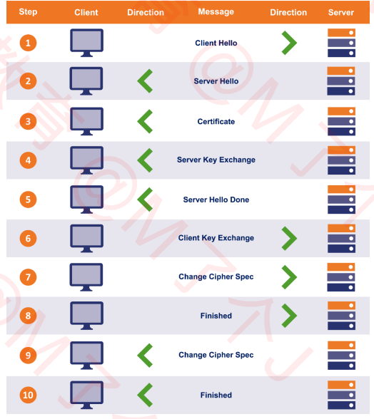

  具体分析每一步的作用：

  1. Client Hello
     客户端发送：TLS 的版本号、支持的加密组件（Cipher Suite）列表、一个随机数（Client Random）等
     加密组件是指所使用的加密算法及密钥长度等加密信息

  2. Server Hello
     服务端返回：TLS 的版本号、选择的加密组件、一个随机数（Server Random）
     选择的加密组件是从接收到的客户端加密组件列表中挑选出来的

  3. Certificate
     服务端返回：服务器的公钥证书（被 CA 签名过的）

  4. Server Key Exchange
     服务端返回：用以实现 ECDHE 算法的其中一个参数（Server Params）
     ECDHE 是一种密钥交换算法
     为了防止伪造，Server Params 经过了服务器私钥签名

  5. Server Hello Done
     服务端返回：告知客户端：协商部分结束

  到目前为止，客户端和服务端之间通过明文共享了：
  Client Random、Server Random、Server Params
  而且，客户端也已经拿到了服务器的公钥证书，接下来，客户端会验证证书的真实有效性

  第 3、4、5 步骤服务端可能会合在一个包返回

  6. Client Key Exchange
     客户端发送：用以实现 ECDHE 算法的另一个参数（Client Params）

  目前为止，客户端和服务器都拥有了 ECDHE 算法需要的 2 个参数：Server Params、Client Params
  客户端、服务器都可以：
  使用 ECDHE 算法根据 Server Params、Client Params 计算出一个新的随机密钥串：Pre-master secret
  然后结合 Client Random、Server Random、Pre-master secret 生成一个主密钥
  最后利用主密钥衍生出其他密钥：客户端发送用的会话密钥、服务器发送用的会话密钥等

  7. Change Cipher Spec
     客户端告知服务器：之后的通信会采用计算出来的会话密钥进行加密，验证客户端的会话密钥

  8. Finished（抓包也称 Encrypted Handshake Message）
     客户端发送：包含连接至今全部报文的整体校验值（摘要），加密之后发送给服务器
     这次握手协商是否成功，要以服务器是否能够正确解密该报文作为判定标准

  9. Change Cipher Spec
     服务端告知客户端：验证服务端的会话密钥

  10. Finished（抓包也称 Encrypted Handshake Message）
      服务端发送：包含连接至今全部报文的整体校验值（摘要），加密之后发送给客户端

  到此为止，客户端服务器都验证加密解密没问题，握手正式结束。后面开始传输加密的 HTTP 请求和响应

  TLS 的连接主要目的就是交换密钥，而相对复杂的设计就是保证生成的密钥安全。

  ### wireShark 解密 HTTPS

  1.  设置环境变量 SSLKEYLOGFILE（浏览器会将 key 信息导出到这个文件）
  2.  设置完成后，可能需要重启才能生效
  3.  在 Wireshark 中选择这个文件
      编辑 → 首选项 → Protocols → TLS

## HTTP 的升级

### HTTP1.1 协议的不足

1. 同一个时间，一个连接只能对应一个请求
   如果要并发，浏览器需要建立多个 TCP 连接。而大多数浏览器允许同时最多 6 个并发连接。
2. 只允许客户端主动发起请求
   一个请求只能对应一个响应
3. 同一个会话的多次请求中，头信息会被重复传输
   通常会给每个传输增加 500~800 字节的开销，如果使用 Cookie，增加的开销更多
   这一点是因为 HTTP 无状态的原因，请求和请求之间并没有联系

### SPDY

SPDY（speedy 的缩写），是基于 TCP 的应用层协议，它强制要求使用 SSL/TLS。它是 Google 在 2009 年开发，作为提高网络传输速度的内部项目。

SPDY 与 HTTP 的联系：

- SPDY 并不用于取代 HTTP，它只是修改了 HTTP 请求与响应的传输方式
  只需增加一个 SPDY 层，现有的所有服务端应用均不用做任何修改。因为它工作在 HTTP 层之下，在 HTTP 到 TCP 中间增加 SPDY 层和 TLS 层。研发一般是工作在 HTTP 层，而之后的两层其实是要求框架或语言支持。比如 Node 或 Tomcat 服务器支持 SPDY。

- SPDY 是 HTTP/2 的前身
  2015 年 9 月，Google 宣布移除对 SPDY 的支持，拥抱 HTTP/2

### HTTP/2

HTTP/2，于 2015 年 5 月以 RFC 7540 正式发表
根据 W3Techs 的数据，截至 2019 年 6 月，全球有 36.5%的网站支持了 HTTP/2

- HTTP2 测试
  http://www.http2demo.io/
  https://http2.akamai.com/demo

- HTTP/2 在底层传输做了很多的改进和优化，但在语意上完全与 HTTP/1.1 兼容，即完全向前兼容
  比如请求方法（如 GET、POST）、Status Code、各种 Headers 等都没有改变
  所以如果想要升级到 HTTP/2：开发者不需要修改任何代码、只需要升级服务器配置、升级浏览器

- HTTP/2 标准文档不强制要求使用 HTTPS，虽然它的前身 SPDY 要求。但是 HTTP/2 已经解决了 HTTPS 加解密相对缓慢的问题。并且所有支持 HTTP/2 的浏览器都强制只使用 TLS(https) 连接。所以可有认为 HTTP/2 只在 https 环境下运行

#### HTTP/2 - 基础概念/特性

基础概念：

- 数据流：已建立的连接内的双向字节流，可以承载一条或多条消息
  所有通信都在一个 TCP 连接上完成，此连接可以承载任意数量的双向数据流

- 消息： 与逻辑 HTTP 请求或响应对应，由一系列帧组成

- 帧：HTTP/2 通信的最小单位，每个帧都包含帧头（会标识出当前帧所属的数据流）
  来自不同数据流的帧可以交错发送，然后再根据每个帧头的数据标识符重新组装

特性：

- 二进制格式
  HTTP/2 采用二进制格式传输数据，而非 HTTP/1.1 的文本（字符串）格式。二进制格式在协议的解析和优化扩展上带来更多的优势和可能。
  将 HTTP/1x 的报文解析为两部分： 头信息 => HEADERS frame ; 请求体 => DATA frame

- 多路复用

  1.  客户端和服务器可以将 HTTP 消息分解为互不依赖的帧，然后交错发送，最后再在另一端把它们重新组装起来
  2.  并行交错地发送多个请求，请求之间互不影响
  3.  并行交错地发送多个响应，响应之间互不干扰
  4.  使用一个连接并行发送多个请求和响应

  所谓多路复用，即多个数据流共用一个 TCP 连接
  有了多路复用，就不必再为绕过 HTTP/1.1 限制而做很多工作，比如 image sprites、合并 CSS\JS、内嵌 CSS\JS\Base64 图片、域名分片等。

- 头部压缩
  HTTP/2 使用 HPACK 压缩请求头和响应头，可以极大减少头部开销，从而提高性能
  早期版本的 HTTP/2 和 SPDY 使用 zlib 压缩，可以将所传输头数据的大小减小 85%~88%，但在 2012 年夏天，被攻击导致会话劫持。所以后被更安全的 HPACK 取代。

  它的压缩原理是

  1. HTTP/2 在客户端和服务器端使用“首部表”来跟踪和存储之前发送的键－值对，对于相同的数据，不再通过每次请求和响应发送；
  2. 首部表在 HTTP/2 的连接存续期内始终存在，由客户端和服务器共同渐进地更新
  3. 每个新的首部键－值对要么被追加到当前表的末尾，要么替换表中之前的值

  如果请求头在静态表中，则直接使用对应的编号。所以请求头的一大段字段，压缩成了一个编号。不在静态或者动态表里的内容，则使用哈夫曼编码来减小体积。

- 服务器推送
  服务器可以对一个客户端请求发送多个响应
  除了对最初请求的响应外，服务器还可以向客户端推送额外资源，而无需客户端额外明确地请求。
  比如客户端请求一个 HTML，服务端除了返回对应的 HTML 外，还会将 HTML 内加载的资源也一并发给客户端。

- 优先级

1. HTTP/2 标准允许每个数据流都有一个关联的权重和依赖关系
   可以向每个数据流分配一个介于 1 至 256 之间的整数，每个数据流与其他数据流之间可以存在显式依赖关系

2. 客户端可以构建和传递“优先级树”，表明它倾向于如何接收响应

3. 服务器可以使用此信息通过控制 CPU、内存和其他资源的分配设定数据流处理的优先级
   在资源数据可用之后，确保将高优先级响应以最优方式传输至客户端

4. 应尽可能先给父数据流分配资源（数节点以根节点为最大）， 同级数据流（共享相同父项）应按其权重比例分配资源

#### HTTP2 存在的问题

- 对头阻塞（head of line blocking）

对头阻塞问题本质是 TCP 协议的问题：即 TCP 对于接收的数据包，如果前面丢包了，接收方不会将后续收到的包向上传递。而是需要等待发送方重传，重传成功后，按顺序向应用层传递。

那么就会带来了对头阻塞的问题的。因为 HTTP/2 采用多路复用，所以发送给服务端的数据包可能是多个数据流乱序的。但是一旦丢包，无法将别的数据流的包向上传递。

QUIC 协议可以解决这个问题，因为其底层使用了 UDP 协议

- 握手延迟

因为 TCP 的 3 次握手以及 TLS 连接，所以就会存在握手延迟。

RTT（Round Trip Time）：往返时延，可以简单理解为通信一来一回的时间

QUIC 协议 RTT 为 0

### HTTP3

目前未完全稳定和标准化，所以是不推荐使用的

Google 觉得 HTTP/2 仍然不够快，于是就有了 HTTP/3
HTTP/3 由 Google 开发，弃用 TCP 协议，改为使用基于 UDP 协议的 QUIC 协议实现
QUIC（Quick UDP Internet Connections），译为：快速 UDP 网络连接，由 Google 开发，在 2013 年实现，于 2018 年从 HTTP-over-QUIC 改为 HTTP/3

HTTP 的演变史如下图所示：
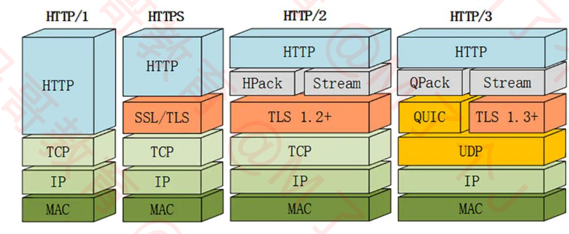

对比 HTTP1.2：

1. 传输层 TCP 协议 => UDP 协议
2. TLS1.2 => TLS1.3
3. HPack 压缩算法 => QPack 压缩算法
4. 应用层 HTTP 之下从 SPDY => QUIC

HTTP3 仍然是向前兼容的，从某种程度可以看做在 HTTP2 层之下加了一层 QUIC 层

疑问：

- HTTP/3 基于 UDP，如何保证可靠传输？
  由 QUIC 协议来保证，计算发送的包和接受的包

- 既然 Google 能够开发 QUIC，为何不开发一个新的不同于 TCP、UDP 的传输层协议？
  说白了就是兼容问题，向前兼容太难

1. 目前世界上的网络设备基本只认 TCP、UDP，如果要修改传输层，意味着操作系统的内核也要修改。
   不要说新增一个传输层协议了，由 IETF 标准化的许多 TCP 新特性都因缺乏广泛支持而没有得到广泛的部署或使用。
   因此，要想开发新的传输层协议获取是可行的，但是要想将其应用是极其困难的一件事情。老设备怎么办？

#### HTTTP/3 特性 - 连接迁移

- TCP 基于 4 要素（源 IP、源端口、目标 IP、目标端口）
  切换网络时至少会有一个要素发生变化，导致连接发生变化（比如手机从流量切换到 wifi，手机 IP 可能发生变化）。当连接发生变化时，如果还使用原来的 TCP 连接，则会导致连接失败，就得等原来的连接超时后重新建立连接。
  所以我们有时候发现切换到一个新网络时，即使新网络状况良好，但内容还是需要加载很久。如果实现得好，当检测到网络变化时立刻建立新的 TCP 连接，即使这样，建立新的连接还是需要几百毫秒的时间

- QUIC 的连接不受 4 要素的影响，当 4 要素发生变化时，原连接依然维持

  QUIC 连接不以 4 要素作为标识，而是使用一组 Connection ID（连接 ID）来标识一个连接
  即使 IP 或者端口发生变化，只要 Connection ID 没有变化，那么连接依然可以维持
  比如:
  当设备连接到 Wi-Fi 时，将进行中的下载从蜂窝网络连接转移到更快速的 Wi-Fi 连接,当 Wi-Fi 连接不再可用时，将连接转移到蜂窝网络连接。这些过程不需要重新建立连接。这就是连接迁移。

  #### HTTTP/3 问题 - 操作系统内核、CPU 负载

  与 HTTP/2 相比，大规模部署的 QUIC 需要近 2 倍的 CPU 使用量。究其原因主要是因为：

  1. Linux 内核的 UDP 部分没有得到像 TCP 那样的优化，因为传统上没有使用 UDP 进行如此高速的信息传输

  2. TCP 和 TLS 有硬件加速，而这对于 UDP 很罕见，对于 QUIC 则基本不存在

  但是随着时间的推移，相信这个问题会逐步得到改善

# 十一、网络安全

网络安全中面临的四张安全威胁：

1. 截获：窃听通信内容
2. 中断：中断网络通信
3. 篡改：篡改通信内容
4. 伪造：伪造通信内容
   它和篡改的区别是，客户端根本没有发请求。伪造确主动向服务端发起了类似客户端请求。

如下图所示：
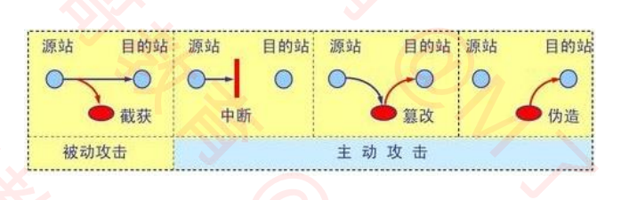

## 网络层 - ARP 欺骗

ARP 欺骗（ARP spoofing），又称 ARP 毒化（ARP poisoning）、ARP 病毒、ARP 攻击

- 效果：
  可让攻击者获取局域网上的数据包甚至可篡改数据包。
  可让网络上特定电脑之间无法正常通信（例如"网络执法官"软件）

- 核心步骤：
  假如主机 C 是攻击者，主机 A、B 是被攻击者

1. C 收到过 A 和 B 的 ARP 广播请求，就可以知道 A 和 B 的 IP 地址和 MAC 地址。
2. 假如 B 再次发送 ARP 请求给 A，正常流程 C 如果发现网络包中的目标 IP 不是自己，应该丢包，什么都不做。但是 C 进行 ARP 欺骗。就会响应该广播请求。响应时源 IP 设置为 B 的 IP 地址，目标 IP 设置为 C 自己的 MAC 地址。
3. B 收到 ARP 响应后，就会更新 ARP 表，把 A 的 MAC 地址改为（IP_A，MAC_C）

4. 当 B 下次要发送数据给 A 时，根据 ARP 表来封装数据包的头部，就会把目标 MAC 地址设为 MAC_C。

5. 当交换机收到该数据包时，根据目标 MAC 地址，就会将数据包转发给 C。

6. 当 C 收到数据包后，可以把它存起来后再发送给 A，达到窃听的效果。C 也可以篡改数据后再发送给 A
   。

网络执法官的原理就是通过 ARP 欺骗。如果要阻断 A 和 B 之间的通信，只需在第 2 步时，把目标 MAC 设置为一个随便定义的无效值，B 发送给 A 的数据包就会发送到这个不存在的 MAC 地址上。通信失败。

### ARP 欺骗 - 防护

1. 静态 ARP，通过静态 ARP 添加到 ARP 表中，而非动态获取。

2. DHCP Snooping
   网络设备可借由 DHCP 保留网络上各电脑的 MAC 地址，在伪造的 ARP 数据包发出时即可侦测到
   DHCP 是给主机动态分配 IP 地址的，所以它是保留着各个 IP 的真实 MAC 地址。所以可以和该对应关系对比
3. 利用一些软件监听 ARP 的不正常变动

## DOS、DDOS

- DoS 攻击（拒绝服务攻击，Denial-of-Service attack）
  使目标电脑的网络或系统资源耗尽，使服务暂时中断或停止，导致其正常用户无法访问

- DDoS 攻击（分布式拒绝服务攻击，Distributed Denial-of-Service attack）
  黑客使用网络上两个或以上被攻陷的电脑作为“僵尸（肉鸡）”向特定的目标发动 DoS 攻击
  2018 年 3 月，GitHub 遭到迄今为止规模最大的 DDoS 攻击

- DoS 攻击可以分为 2 大类

1. 带宽消耗型：UDP 洪水攻击（不断扔 UDP 数据包给被攻击方）、ICMP 洪水攻击
2. 资源消耗型：SYN 洪水攻击、LAND 攻击

### SYN 洪水攻击

发送一些列的 SYN 请求到目标，但是在服务端返回 SYN、ACK 后不发送 ACK（第三次握手）。从而使服务端不停地进行等待，消耗资源。

攻击方法：

1. 跳过发送最后的 ACK 信息
2. 修改源 IP 地址，让目标发送 SYN-ACK 到伪造的 IP 地址。那么肯定不可能收到 ACK（第三次握手）了。

防护：参考 RFC 4987 仅作参考即可。

### 传输层 - LAND 攻击

LAND 攻击（局域网拒绝服务攻击，Local Area Network Denial attack）

通过持续发送相同源地址和目标地址的欺骗数据包，使目标试图与自己建立连接，消耗系统资源直至崩溃
有些系统存在设计上的缺陷，允许设备接受并响应来自网络、却宣称来自于设备自身的数据包，导致循环应答

- 比如发送一个 TCP 连接请求，但是它的源 IP 和目标 IP 都为被攻击的服务器 IP 地址。服务器再接收到 TCP 连接请求后，就会向自己发送 SYN、ACK 请求。无论连接最终是否建立了，都会消耗服务端资源。假如连接建立了，那么就是一个空的 TCP 连接，因为不会再有后续的数据交互了。假如连接没有建立，服务器一直未收到第三次握手。会进行等待浪费资源。

防护：

1. 大多数防火墙都能拦截类似的攻击包，以保护系统
2. 部分操作系统通过发布安全补丁修复了这一漏洞
3. 路由器应同时配置上行与下行筛选器，屏蔽所有源地址与目标地址相同的数据包

### DoS、DDoS 防御

防御方式通常为：入侵检测（检测数据包，比如源 IP 和目标 IP 相同的数据包非法）、流量过滤和多重验证
堵塞网络带宽的流量将被过滤，而正常的流量通过。

防火墙：

1. 防火墙可以设置规则，例如允许或拒绝特定通讯协议，端口或 IP 地址
2. 当攻击从少数不正常的 IP 地址发出时，可以简单的使用拒绝规则阻止一切从攻击源 IP 发出的通信。即将这些不正常的 IP 加入黑名单。
3. 复杂攻击难以用简单规则来阻止，例如 80 端口遭受攻击时不可能拒绝端口所有的通信，因为同时会阻止合法流量
4. 防火墙可能处于网络架构中过后的位置，路由器可能在恶意流量达到防火墙前即被攻击影响

交换机：大多数交换机有一定的速度限制和访问控制能力

路由器：和交换机类似，路由器也有一定的速度限制和访问控制能力

黑洞引导：
将所有受攻击计算机的通信全部发送至一个“黑洞”（空接口或不存在的计算机地址）或者有足够能力处理洪流的网络设备商，以避免网络受到较大影响

流量清洗：
当流量被送到 DDoS 防护清洗中心时，通过采用抗 DDoS 软件处理，将正常流量和恶意流量区分开
正常的流量则回注回客户网站

## 应用层 - DNS 劫持

DNS 劫持，又称为域名劫持
DNS 劫持：攻击者篡改了某个域名的解析结果（比如篡改 DNS 服务器的缓存），使得指向该域名的 IP 变成了另一个 IP，导致对相应网址的访问被劫持到另一个不可达的或者假冒的网址，从而实现非法窃取用户信息（比如篡改后的 IP 是模仿篡改前的网站的，导致用户不感知，继续登录，窃取用户名密码）或者破坏正常网络服务的目的

为防止 DNS 劫持，可以考虑使用更靠谱的 DNS 服务器，比如：114.114.114.114

- 谷歌：8.8.8.8、8.8.4.4
- 微软：4.2.2.1、4.2.2.2
- 百度：180.76.76.76
- 阿里：223.5.5.5、223.6.6.6

## 应用层 - HTTP 协议的安全问题

HTTP 劫持：对 HTTP 数据包进行拦截处理，比如插入 JS 代码。比如你访问某些网站时，在右下角多了个莫名其妙的弹窗广告。

HTTP 协议默认是采取明文传输的，因此会有很大的安全隐患
常见的提高安全性的方法是：对通信内容进行加密后，再进行传输。

常见的加密方式有：

- 不可逆
  单向散列函数：MD5、SHA 等

- 可逆：

1. 对称加密：DES、3DES、AES 等
2. 非对称加密：RSA 等

- 其他

1. 混合密码系统
2. 数字签名
3. 证书

encrypt（加密）、decrypt（解密）、plaintext（明文）、ciphertext（密文）

### 加解密网站

- 综合： https://www.sojson.com/encrypt_des.html
- 综合： https://tool.chinaz.com/tools/textencrypt.aspx

- md5 加密：https://www.cmd5.com/hash.aspx
- md5 解密：https://www.cmd5.com/

### 不可逆加密 - 单向散列函数（One-way hash function）

单向散列函数，可以根据消息内容计算出散列值

单向散列函数也被称为：
消息摘要函数（Message digest function ）
哈希函数（hash function

输出的散列值，也被称为：
消息摘要（Message digest）
指纹（fingerprint）
哈希值
特点：

- 根据任意长度的消息，计算出固定长度的散列值
  散列值的长度和消息的长度无关，无论消息是 1bit、10M、100G，单向散列函数都会计算出固定长度的散列值
- 计算速度快

- 消息（加密内容）不同，散列值也不同
  哪怕消息只有 1 位的差别，生成的散列值也会天差地别

- 具备单向性
  即无法由散列值倒推回加密内容

#### 常见的几种单向散列函数

1.  MD4、MD5
    产生 128bit 的散列值， MD 就是 Message Digest 的缩写，目前已经不安全

    MD5 加密网站：
    https://www.cmd5.com/hash.aspx

    MD5 解密网站：
    https://www.cmd5.com/

    解密原理：枚举值，将可能出现的情况进行枚举。该解密网站声称已经记录 90 万亿条数据，匹配上后返回加密内容

2.  SHA-1
    产生 160bit 的散列值，目前已经不安全

3.  SHA-2
    SHA-256、SHA-384、SHA-512，散列值的长度分别是 256bit、384bit、512bit

4.  SHA-3
    全新标准

#### 单向散列函数 - 应用

- 防止数据被篡改
  通过对比数据（文件）不同时间的散列值，即可知道数据是否被篡改了。

- 密码加密
  目前比较流行的方式，无论是注册还是登录，传输的都是 md5 或其他单向散列函数加密过的密码。包括数据库保存对比的也是单向散列值。这样即使数据库泄露了，黑客获得的也是加密过的密码。
  目前应用不会有告知用户旧密码的需求。就算要修改密码，大概率也是通过手机邮箱等等验证。

### 可逆加密 - 加密解密

不管是对称加密还是非对称加密，只要加密后需要解密出来，必然就需要密钥。

#### 对称加密（Symmetric Cryptography）

在对称加密（又称对称密码）中，加密用的秘钥和解密用的秘钥是相同的。流程图如下所示：
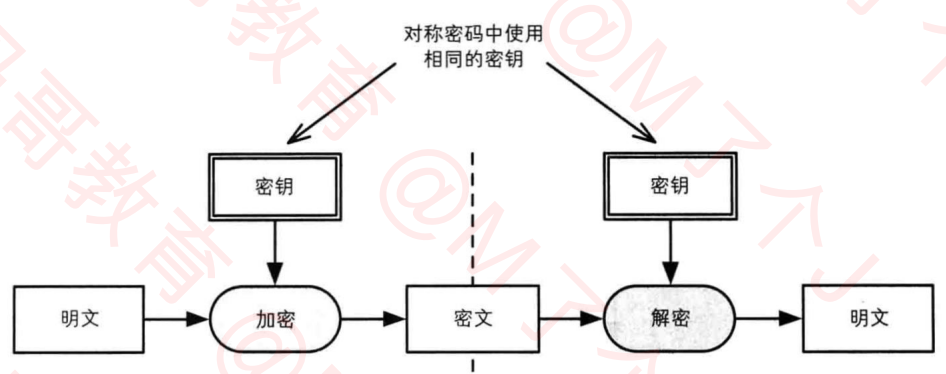

- 常见的对称加密算法有：

1. DES（Data Encryption Standard）
   DES 是一种将 64bit 明文加密成 64bit 密文的对称加密算法，密钥长度是 56bit。
   从规格上将，密钥长度是 64bit，但每隔 7bit 会设置一个用于错误检查的 bit ，因此密钥长度实质上是 56bit。  
   由于 DES 每次只能加密 64bit 的数据，遇到比较大的数据，需要对 DES 加密进行迭代（反复）  
   现状：目前已经可以在短时间内被破解，所以不建议使用
2. 3DES（Triple Data Encryption Algorithm）
   3DES ，将 DES 重复 3 次所得到的一种密码算法，也叫做 3 重 DES。
   三重 DES 并不是进行三次 DES 加密（加密=> 加密=> 加密）。而是加密（Encryption）=> 解密（ Decryption）=> 加密（ Encryption）的过程。在三次加密和解密过程中用的密钥一般不相同。起码加解密不能为同一个，否则和 1 次 DES 是一样的。

   现状：目前还被一些银行等机构使用，但处理速度不高，安全性逐渐暴露出问题

3. AES（Advanced Encryption Standard）
   取代 DES 成为新标准的一种对称加密算法，又称 Rijndae 加密法
   AES 的密钥长度有 128、192、256bit 三种
   现状：目前 AES 已经逐步取代 DES、3DES，称为首选的对称加密算法。
   一般来说我们不应该使用任何自制的密码算法，推荐使用 AES。它经过了全世界密码学家的高品质验证。

##### 密钥配送问题

在使用对称加密时，一定会遇到密钥配送问题，解决办法有如下几种方式：

1. 事先共享密钥（比如私下共享）

2. 密钥配送中心（KDC）

3. Diffie-Hellman 密钥交换

4. 非对称加密（重点了解）

#### 非对称加密（又称公钥密码）

在非对称加密（又称公钥密码）中，加密用的秘钥（加密密钥）和解密用的秘钥（解密密钥）是不同的。

- 加密密钥：一般是公开的，因此该密钥称为公钥（public key）
- 解密密钥：由消息接收者自行保管，不能公开，因此也称为私钥（private key）

加解密流程：
A 想将加密后的内容发送给 B，并且 B 能够解密出来。 需要先由 B （接收方） 产生一对公钥和私钥，并将公钥发送给 A，A 拿到后，加密内容发送给 B，B 利用该公钥对应的私钥进行解密。整个过程很安全，因为私钥没有在网上流通。不存在被截取的风险。
如果反过来 B 要将加密内容发送给 A，则必须由 A 生成一堆公钥和私钥，重复上述过程。 公钥可以发给多方。私钥由自己保管。

公钥和私钥：

- 公钥和私钥是一一对应的，不能单独生成

- 一对公钥和私钥统称为密钥对（key pair）

- 由公钥加密的密文，必须使用与该公钥对应的私钥才能解密（这个是很明显的）

- 由私钥加密的密文，必须使用与该私钥对应的公钥才能解密（有意义，数字签名应用）

- windows 系统可以使用 OpenSSL 库生成公钥和私钥

与对称加密对比：

1. 更加复杂并且安全
2. 但是加解密速度更慢

加密算法：

- RSA：
  目前使用最广泛的非对称加密算法是 RSA。RSA 由它的三位开发者姓氏首字母组成

### 混合密码系统（Hybrid Cryptosystem）

- 混合密码系统：是将对称加密和非对称加密的优势相结合的方法
- 解决了非对称加密速度慢的问题。并通过非对称加密解决了对称加密的密钥配送问题

- 网络上的密码通信所用的 SSL/TLS 都运用了混合密码系统

#### 混合密码 - 加密

- 会话密钥（session key）
  为本次通信随即生成的临时密钥
  作为对称加密的密钥，用于加密消息（发送内容），提高速度。

- 具体加密步骤如下所示：
  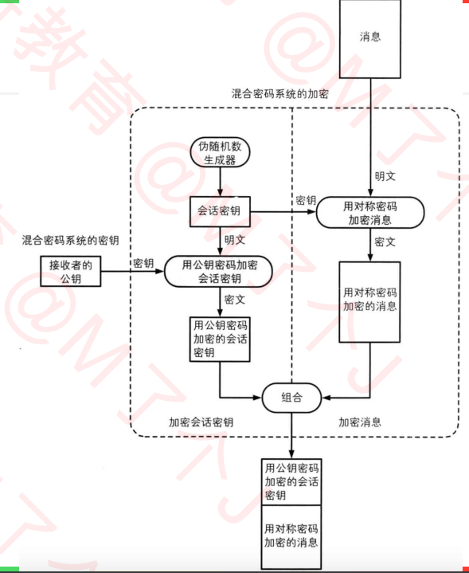

总结：
使用对称加密加密消息体，再使用非对称加密加密对称加密使用的密钥。
这样数据量比较大的消息体使用对称加密加快速度。而密钥一般是固定位数的，数据量很小，使用非对称加密。既提高了效率，又保证了安全性。普遍使用。

#### 混合密码 - 解密

解密步骤：

1. 消息接收者用自己的私钥解密出会话密钥
2. 再用第 1 步解密出来的会话密钥，解密消息

### 数字签名

数字签名的作用：

1. 确认消息的完整性
2. 识别消息是否被篡改
3. 防止消息发送人否认

在数字签名技术中，有以下 2 种行为：

1. 生成签名：
   由消息的发送者完成，通过“签名密钥” 生成

2. 验证签名：
   由消息的接收者完成，通过“验证密钥”验证

如何能保证这个签名是消息发送者自己签的？
用消息发送者的私钥进行签名（之前提到过，私钥加密的消息，只有其公钥可以解密出来，所以可以确认签名身份）

过程：

1. 消息发送者生成一对公钥和私钥
2. 发送者将消息使用单向散列函数生成散列值
3. 将散列值通过私钥进行加密
4. 将消息本身和加密后的散列值发送给对方
5. 接收方收到后，也将消息使用同样的单向散列函数生成散列值，并且使用公钥对发送过来的散列值进行解密。
6. 最后接收方对比接收消息的散列值和解密发送方的散列值是否一样。以此验证消息是否被篡改。

问题：
数字签名不能保证机密性？
数字签名的作用不是为了保证机密性，仅仅是为了能够识别内容有没有被篡改。
但是可以结合加解密和数字签名。

数字签名从某种意义上看，像非对称加密反过来使用，两者之间的关系总结：

1. 既然是加密，那肯定是不希望别人知道我的消息，所以只有我才能解密。
   所以公钥负责加密，私钥负责解密

2. 既然是签名，那肯定是不希望有人冒充我发消息，所以只有我才能签名
   所以私钥负责签名，公钥负责验签

### 公钥的合法性

密码混合系统看上去很完美。但是消息接收者 B 还是需要把自己的公钥发送给发送者 A。那么就会存在攻击者伪造公钥的问题。
过程：

1. 攻击者自己生成一对公钥和私钥，然后拦截 B 发送给 A 的公钥，替换成自己的公钥。
2. 然后当 A 发送消息给 B 时，攻击者拦截消息，并且使用自己的私钥解密。就可以拦截甚至篡改消息了。然后再把消息通过 B 的公钥进行加密，加密后发送给 B，这样 A、B 无感知地认为消息是安全抵达的。 攻击者达到了拦截甚至篡改的目的。

这个过程即使使用上数字签名也没有用，因为数字签名的前提，是对方要先知道你的公钥。所以攻击者依然可以进行伪造公钥，从而伪造签名。该问题就需要使用证书解决

### 证书（Certificate）

密码学中的证书，全称叫公钥证书（Public-key Certificate，PKC），跟驾驶证类似。

- 里面有姓名、邮箱等个人信息，以及此人的公钥
- 并由认证机构（Certificate Authority，CA）施加数字签名

CA 就是能够认定“公钥确实属于此人”并能够生成数字签名的个人或者组织

- 有国际性组织、政府设立的组织。有通过提供认证服务来盈利的企业。个人也可以成立认证机构

A 想要发送密文给 B
过程：

1. B 生成一对密钥对
2. 在权威机构注册自己的公钥
3. 权威机构利用自己的私钥对 B 的公钥施加数字签名生成证书
4. 将证书和公钥一起发送给 A
5. A 拿到证书后，使用权威机构的公钥对证书进行解密，拿到证书认证过的 B 的公钥，和 B 现在发过来的公钥进行对比。验证公钥 B 的正确性。

在这个过程中，如果 B 被篡改了。那么和解密证书得到的公钥就会对不上。
如果证书被伪造了，那么利用权威机构公钥就无法解密
各大 CA 的公钥，默认已经内置在浏览器和操作系统中了。所以伪造权威认证机构的公钥可能性很低。

查看 windows 已经信任的证书

1. Windows 键 + R >>> 输入 mmc
2. 文件 >>> 添加/删除管理单元
3. 证书 >>> 添加 >>> 我的用户账户 >>> 完成 >>> 确定

# 十二、其他协议

## RARP（Reverse Address Resolution Protocol）

RARP：逆地址解析协议。使用与 ARP 相同的报文结构，作用于 ARP（通过 IP 地址获取 MAC 地址） 相反，用于将 MAC 地址转换为 IP 地址（根据 MAC 获取 IP）。后来被 BOOTP（HDCP 为其升级版）、HDCP 所取代。

## ICMP（Internet Control Message Protocol）

互联网控制消息协议

IPv4 中的 ICMP 被称作 ICMPv4，IPv6 的 ICMP 则被称作 ICMPv6

作用：通常用于返回错误信息。比如 TTL 值过期、目的不可达等。ICMP 的错误信息总是包括了源数据并返回给发送者。

## Socket

一套网络编程 API，利用它可以建立网络连接。一般操作系统层面提供，像语言和库层面提供的 Socket 对象也是基于操作系统的 Socket 向上封装的。

## WebSocket

和 Socket 没有任何关系

为了更好的节省服务器资源和带宽，为了能够实时通讯，HTML 规范中出现了 WebSocket 协议。

Websocket 是基于 TCP 的支持全双工通信的应用层协议。在 2011 年由 IETF 标准化为 RFC 6455，后由 RFC 7936 补充规范。客户端、服务器，任何一方都可以主动发消息给对方。

应用：
社交订阅、股票基金报价、体育实况更新、多媒体聊天、多玩家游戏等

与 HTTP 比较：

1. HTTP 只能由客户端发起。所以早期为了实现服务端推送，使用的是客户端轮询的方式。对客户端的消耗很大。

2. WebSocket 和 HTTP 属于平级关系，都是应用层的协议
   其实 TCP 本身就是支持全双工通信的（客户端、服务器均可主动发消息给对方），只是 HTTP 的“请求-应答模式”限制了 TCP 的能力。所以也有部分人认为，WebSocket 只是在 TCP 基础上做了一层封装，和 TCP 是比较类似的。

3. WebSocket 使用 80（ws://）、443（wws://）端口，主要是为了兼容 http/https 协议，可以绕
   过大多数防火墙的限制。

4. 与 HTTP 不同的是，WebSocket 需要先建立连接（应用层建立连接）
   这就使得 WebSocket 成为一种有状态的协议，之后通信时可以省略部分状态信息（建立连接时已经知道对方是谁等等）

### WebSocket - 建立连接

WebSocket 需要借助 HTTP 协议来建立连接（也叫握手，Handshake）
-- 思考下为啥非得借助 HTTP 协议呢？WebSocket 是 H5 规范提出，又从它的取名“WebXXX”可以看出，是纯在浏览器端实践的一种协议。而浏览器端以前一直使用的 HTTP。所以升级 HTTP 协议就会来到 WebSocket。

由客户端（浏览器）主动发出握手请求

- HTTP 请求头 Connection 必须设置 Upgrade，表示客户端希望连接升级

- HTTP 请求头 Upgrad 必须设置为 WebSocket，表示希望升级到 WebSocket 协议

- 请求头 Sec-WebSocket-Version，表示支持的 Websocket 版本，RFC 6455 要求使用的版本是 13。

- 请求头 Sec-WebSocket-Key 是客户端生成的随机字符串，服务器接收到客户端的 Sec-WebSocket-Key 后，会进行以下操作：

  1. Sec-WebSocket-Key 加上一个固定的 GUID 值（258EAFA5-E914-47DA-95CA-C5AB0DC85B11）
  2. 将 1 的结果进行 SHA-1 摘要计算
  3. 将 2 的结果进行 Hex To Base64 编码，Hex To Base64 和普通 Base64 是不一样的。Hex To Base64 是将源数据当做 16 进制数据进行 Base64 编码。
  4. 将 3 的结果做为 Sec-WebSocket-Accept 响应头的值，返回给客户端

  这样做的目的是，可以尽量避免普通 HTTP 请求被误认为 WebSocket 协议

## WebService

WebService，译为：Web 服务，是一种跨编程语言和跨操作系统平台的远程调用技术标准

- 使用场景
  天气预报、手机归属地查询、航班信息查询、物流信息查询等

是一种比较久的技术，HTTP 服务本身就是跨编程语言和操作系统的。
只不过在以前，比如天气预报，是气象局把自己的服务以 WebService 形式暴露出来，让第三方程序可以调用这些服务功能

- 事实上，WebService 完全可以用普通的 Web API 取代（比如 HTTP + JSON）
  现在很多企业的开放平台都是直接采用 Web API

### WebService - 核心概念

- SOAP（Simple Object Access Protocol），译为：简单对象访问协议。很多时候，SOAP = HTTP + XML。WebService 使用 SOAP 协议来封装传递数据。SOAP 协议规定了 XML 的传输格式

- WSDL（Web Services Description Language），译为：Web 服务描述语言
  一个 XML 文档，用以描述 WebService 接口的细节（比如参数、返回值等），一般在 WebService 的 URL 后面跟上“?wsdl”获取 WSDL 信息。比如：http://ws.webxml.com.cn/WebServices/WeatherWS.asmx?wsdl

总结：WebService 是使用固定 XML 格式（SOAP 标准）的 HTTP 接口，一般是政府、公司想要公开自己的数据时使用。该技术很老旧，现在一般都直接使用 HTTP+JSON，简单方便。

## RESTful

- REST（Representational State Transfer-表现层状态转移）
  是一种互联网软件架构设计风格
  定义了一组用于创建 Web 服务的约束， 符合 REST 架构的 Web 服务，称为 RESTful Web 服务

- RESTful-实践建议

  1. URL 中使用名词（建议用复数形式），不使用动词

  2. 使用 HTTP 的方法表达动作

  3. 一个资源连接到其他资源，使用子资源的形式
     如： GET /users/6/cars/88 -- 如获取 id 为 6 的用户下的 88 编号的车

  4. API 版本化 （即版本体现在 URL 中）

  5. 返回 JSON 格式的数据

  6. 发生错误时，不要返回 200 状态码

## HTTPDNS

HTTPDNS 是基于 HTTP 协议向 DNS 服务器（该服务器本质是 HTTP 服务器，只不过它的作用是以前 DNS 服务器的作用）发送域名解析请求。替代了基于 DNS 协议向运营商 Local DNS 发起解析请求的传统方式。

- 为什么要这么做呢？

可以避免 Local DNS 造成的域名劫持和跨网访问问题，常用在移动互联网中（比如在 Android、iOS 开发中）。浏览器的域名解析按照它自身的 DNS 解析的路走，不像移动互联网 APP 开发，完全由自身开发。

- 使用：市面上已经有现成的解决方案
  腾讯云：https://cloud.tencent.com/product/httpdns
  阿里云：https://help.aliyun.com/product/30100.html

  移动端集成相关的 SDK 即可使用 HTTPDNS 服务

## FTP（File Transport Protocol - 文件传输协议）

在 RFC 959 定义了此规范，是基于 TCP 的应用层协议。
在 RFC 1738 中有定义，FTP 的 URL 格式为：ftp://[user[:password]@]host[:port]/url-path

### FTP - 连接模式

FTP 有 2 种连接模式：主动（Active）和被动（Passive）。不管是哪种模式，都需要客户端和服务器建立 2 个连接。

1.  控制连接：用于传输状态信息（命令，cmd）
2.  数据连接：用于传输文件和目录信息（data）

### FTP - 主动模式

1.  客户端打开一个随机的命令端口，端口号必须大于 1024，假设为 N
    客户端命令端口 N 和服务端命令端口 21 建立连接

2.  客户端开始监听 N+1 数据端口
    开启后，客户端 N 端口向服务器发送一个 Port 命令给服务器的命令端口 21，告知服务器，客户端正在监听的数据端口为 N+1，并且已准备好从此端口接收数据了。

3.  服务器打开数据端口 20，并且创建和客户端数据端口（N+1）的连接

### FTP - 被动模式

客户端还是通过两个随机的端口与服务器建立连接。命令端口 N、数据端口 N+1。

1. ① 客户端的命令端口 N 用于连接服务器的命令端口 21
2. 客户端通过命令端口 N 发送 PASV 命令给服务器的命令端口 21
   PASV 命令代表连接模式为被动模式
3. 服务器打开一个随机的数据端口 P，并告知客户端该端口号 P

4. 客户端数据端口 N+1 发起与服务器数据端口 P 的连接

### FTP - 总结

- FTP 的特点就是要建立命令-数据两个连接。命令和数据分开。
- 主动和被动在于服务端。
  主动模式下，由服务端主动发送数据给客户端，该端口固定为 20。
  被动模式下，服务端等待着客户端发送数据，会新建一个随机端口和客户端的数据端口建立连接。

### FTP - 实践

- FTP - 服务器 ：一般由操作系统自行搭建
  win10 搭建步骤可根据该网址：https://jingyan.baidu.com/article/0bc808fc408fa91bd585b94f.html

## 邮件相关的协议

- 发邮件使用的协议

  1.  SMTP（Simple Mail Transfer Protocol），译为：简单邮件传输协议。
      基于 TCP，标准参考 RFC 5321，服务器默认使用 25 端口，SSL/TLS（SMTPS）使用 465 端口

- 收邮件使用的协议

  1. POP（Post Office Protocol），译为：邮局协议。
     基于 TCP，最新版是 POP3，标准参考 RFC 1939，服务器默认使用 110 端口，SSL/TLS 使用 995 端口

  2. IMAP（Internet Message Access Protocol），译为：因特网信息访问协议
     基于 TCP，最新版是 IMAP4，标准参考 RFC 3501，服务器默认使用 143 端口，SSL/TLS 使用 993 端口

  邮件大致收发过程如下图所示：
  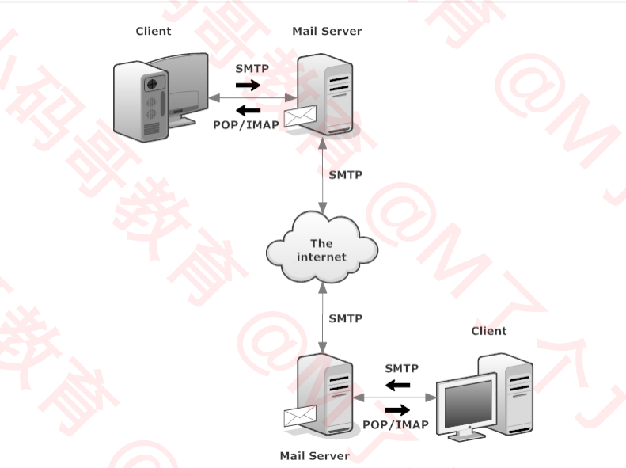

  ### POP VS IMAP

  POP 协议和 IMAP 协议都是邮件接收协议，那么他们有什么区别呢？

  - POP 的特点：

    1.  客户端连接服务器时，将会从服务器下载所有邮件
        可以设置下载完后，立即或一段时间后删除服务器邮件
    2.  客户端的操作（比如删除邮件、移动到文件夹）不会跟服务器同步

    3.  每个客户端都是独立的，都可以获得其自己的电子邮件副本（同一个账号在不同电脑里，看到的邮件可能是不同的，因为客户端可以删除、移动邮件等）

  - IMAP 的特点：

    1. 客户端连接服务器时，获取的是服务器上邮件的基本信息，并不会下载邮件
       等打开邮件时，才开始下载邮件

    2. 客户端的操作（比如删除邮件、移动到文件夹）会跟服务器同步

    3. 所有客户端始终会看到相同的邮件和相同的文件夹

    从特点来看，IMAP 更符合现代的软件模式和更类似 Web 模式。客户端的操作和服务器同步。

# 十三、 补充

## VPN

VPN（Virtual Private Network），译为：虚拟私人网络。
它可以在公共网络上建立专用网络，进行加密通讯

- 使用场景：
  VPN 客户端和公网（ISP）连接，然后数据会先通过因特网传输到 VPN 服务端，再由 VPN 服务端发送给最终的业务服务端。一般来说 VPN 服务端和业务服务都是部署在一起的，比如都部署在公司。
  那么这么做的好处是，VPN 客户端和 VPN 服务端之间是会进行加密和解密的。这就保证了 VPN 上的数据传输的安全性。而到了 VPN 服务器后，公司内部网络的通信，也就很安全了。

作用：

- 提高上网的安全性

- 保护公司内部资料

- 隐藏上网者的身份
  使用了 VPN 客户端后，所有信息都被加密，比较难获知请求来自哪里

- 突破网站的地域限制
  有些网站针对不同地区的用户展示不同的内容，可以买一台其他地区的 VPN 服务器，就可以模拟其他地区访问

- 突破网络封锁
  因为有 GFW 的限制，有些网站在国内上不了。就可以使用 VPN 突破封锁
  GFW（Great Firewall of China）:中国长城防火墙

  ### VPN 与 代理的区别

  - 软件
    VPN 一般需要安装 VPN 客户端软件
    VPN 一般需要安装 VPN 客户端软件
  - 安全性
    VPN 默认会对数据进行加密
    代理默认不会对数据进行加密（数据最终是否加密取决于使用的协议本身）
  - 费用
    一般情况下，VPN 比代理贵

  ### VPN 实现原理

  实现原理：使用了隧道协议（Tunneling Protocol）

  常见的 VPN 隧道协议有：

  - PPTP（Point to Point Tunneling Protocol）：点对点隧道协议
  - L2TP（Layer Two Tunneling Protocol）：第二层隧道协议
  - IPsec（Internet Protocol Security）：互联网安全协议
  - SSL VPN（如 OpenVPN）

  一般工作在传输层或者数据链路层

  ## tcpdump

  tcpdump 是 linux 平台的抓包分析工具，Windows 版本是 WinDump
  手册：https://www.tcpdump.org/manpages/tcpdump.1.html
  教程：https://danielmiessler.com/study/tcpdump/

  一般使用 wireshark 就可以了，tcpdump 是非图形化界面的，在命令行中显示的，所以使用起来没有那么直观。但是 tcpdump 抓到的包可以直接导入 wireShark 查看

## 网络爬虫（Web crawler）

网络爬虫也叫做网络蜘蛛（Web Spider），它是模拟人类使用浏览器操作页面的行为，对页面进行相关的操作。

- 常用爬虫工具：Python 的 Scrapy 框架

- 网络爬虫违法吗？
  爬公开的数据一般是不违法的，本来就是公开的网页，知识通过技术手段简化了手动收集的麻烦。但是如果网页有说明或者说是设计到隐私，比方说需要会员才能享有的资源爬下来就违法了。

- robots.txt
  robots.txt 是存放于网站根目录下的文本文件，比如https://www.baidu.com/robots.txt
  用来告诉爬虫：哪些内容是不应被爬取的，哪些是可以被爬取的，因为一些系统中的 URL 是大小写敏感的，所以 robots.txt 的文件名应统一为小写。
  它并不是一个规范，而只是约定俗成的，所以并不能保证网站的隐私

  具有一定个数，如：
  User-agent：允许的爬虫名称 \*代表所有爬虫
  Allow：允许爬取的 url
  DisAllow：不允许爬取的 url

### 网络爬虫 - 搜索引擎

搜索引擎的内部原理，就是大量使用了爬虫，只有搜集了大量爬虫爬取到的页面数据，才能根据用户搜索的关键字，去页面数据里进行比对，然后根据一定算法展现给用户。

等到把 HTML 页面抓取下来后，其实就是字符串匹配的工作了。

## 无线网络

- 比如手机 A 和手机 B 利用无线网络进行通信。
  过程：手机 A 将数据发送到手机的天线上，天线检测到最近的基站，将数据发送给基站，基站和基站之间一般是通过有线（比如光纤）通信，然后基站再将数据传送给 B 的天线上。

- 手机连接无线 wifi：
  路由器内部有一个无线 AP（Access Point-无线接入点），无线 AP 就可以和手机建立连接。所以手机天线先将数据发送给路由器的无线 AP，无线 AP 是路由器内部的一部分，再通过路由器连接到外网。WAN 口。
